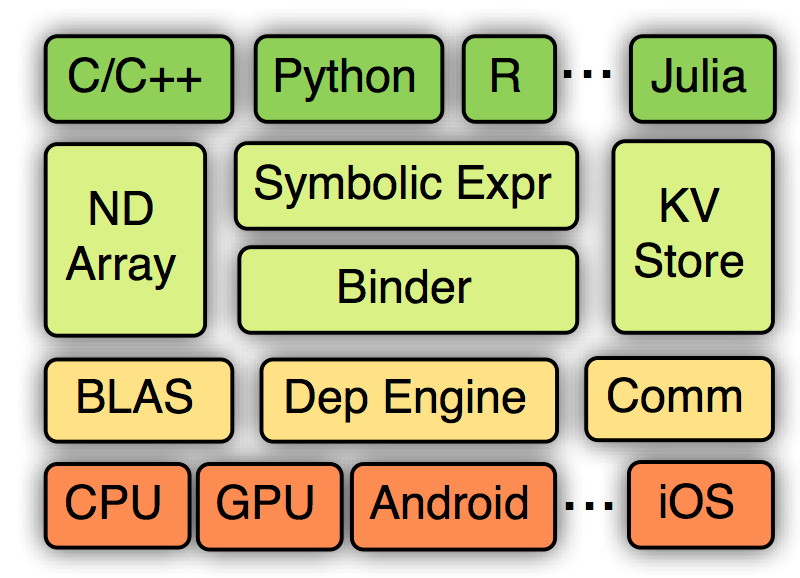

# MXNet系统架构

## 架构

如下图所示：从上到下分别为各种主语言的嵌入，编程接口（矩阵运算，符号表达式，分布式通讯），两种编程模式的统一系统实现，以及各硬件的支持。

1._**Symbolic Expr**_：声明式的符号表达式

2._**NDArray**_：命令式的张量计算

3._**KVStore**_：分布式的 key-value存储来实现多设备之间的数据交互。主要2个函数

* push：将 key-value 对从一个设备 push 进存储
* pull：将某个 key 上的值从存储中 pull 出来

> push 和 pull 跟 NDArray 一样使用了**延后计算**的技术。将对应的操作提交给后台引擎，而引擎则调度实际的数据交互

4.**数据读入模块**：提供工具能将任意大小的样本压缩打包成单个或者多个文件来加速顺序和随机读取。通常数据存在本地磁盘或者远端的分布式文件系统上，如HDFS，每次只需要将当前需要的数据读进内存。

> MXNet提供**迭代器**可按块读取不同格式的文件。迭代器使用多线程来解码数据，并使用多线程**预读取**来隐藏文件读取的开销

5.**训练模块**：MXNet实现了常用的优化算法来训练模型，用户只需要提供数据迭代器和神经网络的Symbol即可。此外，还可提供额外的 KVStore 来进行分布式的训练

## 实现

1.**计算图**

* 计算图优化
* 内存申请

2.**引擎**：在MXNet中，所有的任务，包括张量计算，symbol执行，数据通讯，都会交由引擎来执行

* 所有的资源单元，如NDArray、临时空间，都会在引擎处注册一个唯一的标签
* 每个提交给引擎的任务都会标明它所需要的资源标签
* 引擎则会跟踪每个资源，若某任务所需要的资源到位了，那么引擎则会调度和执行这个任务

3.**数据通讯**：KVStore的实现是基于参数服务器\(parameter server\)

4.**可移植性**：MXNet核心使用C++实现，并提供C风格的头文件，因此方便系统移植

## 参考文献

1.MXNet设计和实现简介：[http://www.cnblogs.com/zhizhan/p/5118185.html](http://www.cnblogs.com/zhizhan/p/5118185.html)s