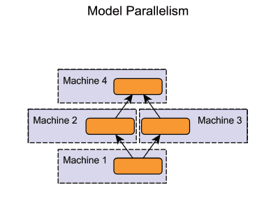
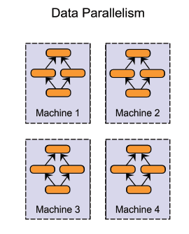

# 分布式训练

## 简介

利用多台主机进行任务的分割，每台主机负责部分数据的计算。

## 分布式训练方式

> 可以两种方式组合使用：在同一台机器上采用模型并行化，在机器之间采用数据并行化

### 模型并行化：Model parallelism

分布式系统中的不同主机负责单个模型中的不同部分，相当于每个主机负责一个**模块**

### 数据并行化：Data parallelism

分布式系统中不同主机拥有同一模型的多个副本，每个主机负责数据的一部分，最后将所有计算结果汇总。这种方式是大多数分布式系统的首选，数据并行化在实现难度、容错率和集群利用率方面都优于模型并行化

## 参考文献

1.分布式训练神经网络模型的概述：[http://geek.csdn.net/news/detail/105793](http://geek.csdn.net/news/detail/105793)