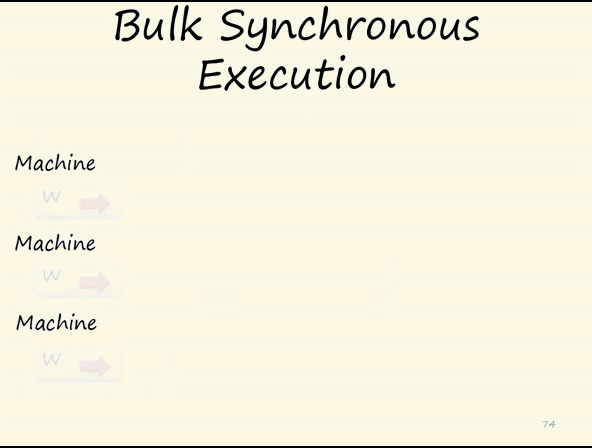
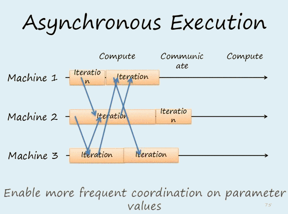
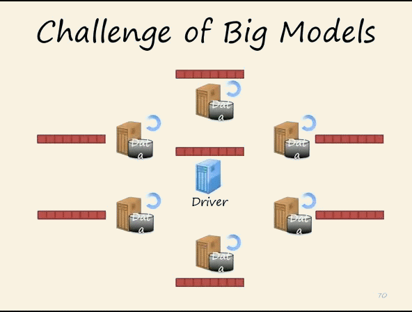
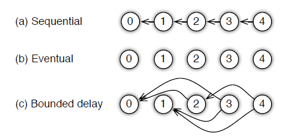
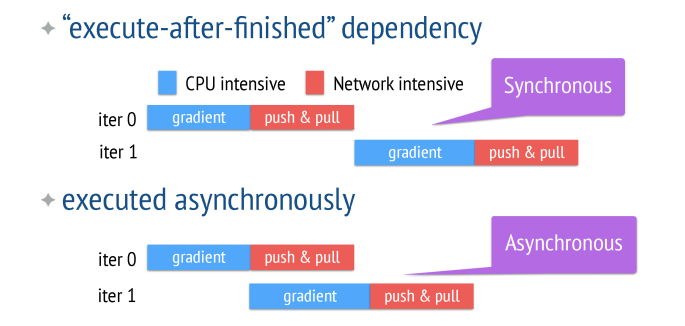
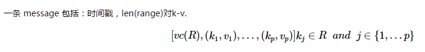
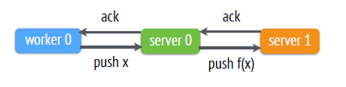
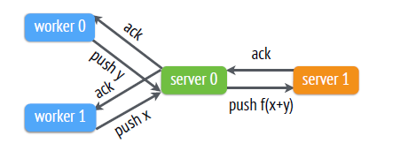

# Parameter Server：参数服务器

## 简介

mxnet 的分布式训练特性就是由`Parameter Server`提供支持的。分布式的支持是为了解决快速增长的数据和参数的问题，大数据的带来的挑战：

* 访问这些巨量的参数，需要大量的**网络带宽**支持
* 大多机器学习算法都是**连续型**的，只有上一次迭代完成\(各个worker都完成\)之后，才能进行下一次迭代，这就导致了如果机器之间性能差距大\(木桶理论\)，就会造成**性能**的极大损失
* 容错能力

## 与通用分布式系统的区别

### 通用分布式系统：同步迭代

**每次迭代都强制同步**，通常在几十个节点上，它们的性能可以表现的很好，但是在**大规模集群中**，这样的每次迭代**强制同步的机制会因为木桶效应变得很慢**。如下所示，强制**同步迭代**情况下，当集群某节点运行时间过长，会造成资源的浪费。即：**同步迭代机制容易因为个别机器低性能的原因导致全局性能的降低**.

### parameter server：异步迭代

为了解决同步迭代的缺陷，parameter server 吸取了`Graphlab`异步机制的优势，并解决了其在扩展性上的劣势。

> Graphlab：使用C++实现的基于图像处理模型的开源图计算框架。使用图形抽象实现异步调度通信。

> 问：数据一致性如何保证？

parameter的优势：

* _**Efficient Communication**_：采用**异步通信**机制，**若非必要，否则不需要等待其他节点任务完成**，降低延迟。
* _**Flexible consistency models**_：宽松的一致性模型，进一步降低延迟和同步成本
* _**Elastic Scalability**_：弹性扩展，使用**分布式hash表**，使得新的 server 随时可以加入到集合，不需要重新运行系统
* _**Fault Tolerance and Durability**_：容灾性能好。从非灾难性机器故障中恢复，只需1s，不需中断计算
* _**Ease of use**_：便于使用。全局共享的参数可表示为各种形式，如vector,matrices等，方便机器学习算法的开发，且提供的线性代数的数据类型都具有高性能的多线程库。

## 系统架构

在 _parameter Server_ 中，每个 **Server **实际上只负责分到的**部分参数\(servers共同维持一个全局共享参数**\)，每个 **work **也只是负责**部分数据的处理**任务。

* _**server**_：各server节点之间可以进行通信，server group共同维持所有参数的更新。server使用一致性 hash 来存储&lt;key,value&gt;键值对。
* _**server manage**_：manage节点负责维护元数据的一致性，如各节点状态，参数的分配情况
* _**work**_：各 work 之间没有通信，只与自己的 server 进行通信
* _**task scheduler**_：每个 work group 都有一个 task scheduler，负责分配任务给 work，并监控 work 状态。每当有 work 加入或脱离，将重新分配任务

如上，每个子节点都只维护自己分配到的参数\(黑色部分\)，自己的那部分数据处理完毕后，返回结果给主节点进行全局更新，然后主节点再像子节点传递新的参数。

> 问：每次子节点返回数据给主节点更新，是不是会强行同步其他节点的数据？若强行同步其他节点数据，而其他节点有使用到之前的旧数据，那么是不是该节点之前的计算就白费了，得重新进行？---&gt;数据/任务之间的依赖/关联性

parameter server 提供了多种任务依赖方式：

1.Sequential：任务/数据之间有依赖，只有上一个任务完成才能进行下一个任务

2.Eventual：各个任务之间独立

3.Bounded delay：\(1\) 和 \(2\) 之间的特殊情况，可以设置一个 τ 作为最大的延时时间，只有 &gt;τ 之前的任务都被完成了，才能开始一个新的任务。

**异步任务**能够提高系统的效率，但容易降低算法的收敛速度。异步任务和同步任务的区别如下图所示：

parameter server 使用 vector clock 来记录每个节点中参数的时间戳，使用 message 来进行通信，message 是最基本的通信格式。

### 一致性

parameter server 在数据一致性上，使用的是传统的**一致性哈希**算法，能在分布式系统中，动态增加和移除节点的同时还能保证系统存储与key分配的性能效率。

slave 和 master 之间数据的一致性的实现方式：2种

1._**Chain replication**_：链式复制，默认方式，强一致性，可靠

* **更新**：**只能**发生在数据**头节点，**然后更新逐步后移，直到更新到达尾节点，并由尾节点向客户确认更新成功
* **查询**：客户查询**只能**在**尾节点**进行，以此保证强一致性

2.Replication after Aggretation：聚合后复制

## 参考文献
1.Parameter Server 详解：[http://blog.csdn.net/cyh\_24/article/details/50545780](http://blog.csdn.net/cyh_24/article/details/50545780)