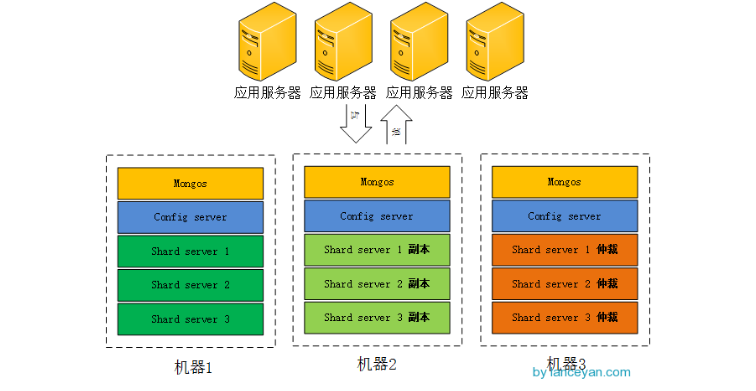

# MongoDB高可用集群
## 一、简介
在此之前已经了解过副本集群和分片集群的知识，知道**分片集群的目的**是分担单节点压力，将数据存储在各个分片上，分片又可以分布在不
同节点上。**副本集群的目的**是为了高可用；**若仅存在副本集群**，一旦达到海量数据，会造成单台节点的数据存储空间不足；**若仅仅
存在分片集群**，一旦某个MongoDB节点宕机\(或某个分片挂了\)，那么就会丢失该节点上对应分片所存储的数据；因此对于一个MongoDB高可
用集群，需要结合2种集群共同构建。

| **特征** | **ReplicaSet集群** | **Shard集群** |
| :--- | :--- | :--- |
| 目的 | 高可用 | 海量数据分布式存储，分担单节点压力 |
| 组成 | Master,Slave节点 | ConfigServer, Router, Shard |
| 缺点 | 仅master节点拥有读写权限；数据存储、网络IO、CPU与内存等依赖服务器性能 | 数据存储无高可用 |

## 二、高可用集群
根据上述所知，要实现一个高可用的MongoDB集群，需要同时利用副本集群和分片集群来实现。集群组成如下所示：
* Router：3 个
* ConfigServer：3 个
* Shard：3 个
* Replica Set：每个 Shard 拥有 3 个 = 2 副本 + 1 仲裁

