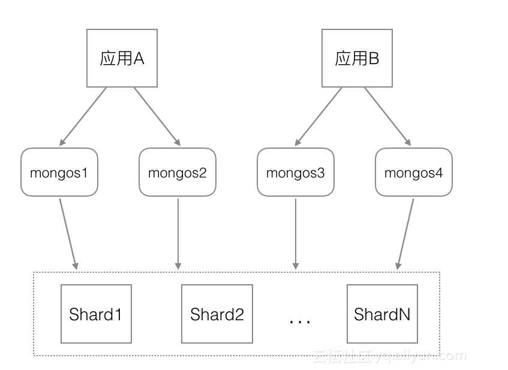

# MongoDB分片集群
## 一、简介
前面介绍了 mongodb 其中一种集群副本集群，副本集群虽然可以做到 master 节点宕机后 slave 节点晋升为 master，从而保证高可用。但其**缺点**是只有 master 节点拥有数
据读写权限，一旦有组件(如 ceilometer)在配置时指定的 master 节点宕机，重新选举 master，就会使组件无法读写数据库，导致组件不可用。在Mongodb里面存在另一种集群，就
是**分片技术**,通过在多台机器上分割数据，使得数据库系统能存储和处理更多的数据，满足MongoDB 数据量大量增长的需求。分片集群主要用于解决如下问题:
* 复制所有的写入操作到主节点
* 延迟的敏感数据会在主节点查询
* 单个副本集限制在12个节点
* 当请求量巨大时会出现内存不足
* 本地磁盘不足
* 垂直扩展价格昂贵

## 二、集群结构
分片集群结构如下图所示


分片集群的组件主要有3个：
* Config Server
* Router
* Shard

### 2.1 Config Server
mongod实例，存储了整个 Cluster Metadata(如分片服务器信息、数据路由信息等)。mongos第一次启动或者关掉重启就会从 config server
加载配置信息，以后如果配置服务器信息变化会通知到所有的 mongos 更新自己的状态，以此保证准确路由。
> 在生产环境通常有多个 config server 配置服务器，因为它存储了分片路由的元数据

### 2.2 Router
前端路由，客户端由此接入。**让整个集群看上去像单一数据库**，即请求转发中心，负责将对应的数据请求转发到对应的shard服务器上
> 生产环境通常有多 mongos 作为请求的入口，防止单点故障。

### 2.3 Shard
用于存储实际的数据块；实际生产环境中一个shard server 可由几台机器组成一个replica set 承担，防止主机单点故障。
> Shard 实际上就是一个普通的 mongod 进程

## 三、分片集群部署
### 3.1 环境说明
| **角色** | 10.158.113.155 | 10.158.113.156 | 10.158.113.157 |
| :--- | :--- | :--- | :--- |
| **ConfigServer** | 27100 |  |  |
| **Router** | 27200 |  |  |
| **Shard** | 27020, 27021 | 27022 | 27023 |
> 注：此处使用的端口号都不是 mongodb 默认端口号，而是自定义端口号

### 3.2 部署
1.启动ConfigServer：**mongod**
```
# 10.158.113.155
$ mongod --port 27100 --dbpath /var/lib/mongodb --logpath /var/log/mongodb/configserver.log --fork
about to fork child process, waiting until server is ready for connections.
forked process: 87
child process started successfully, parent exiting
```

2.启动Router：**mongos**
```
# 10.158.113.155
$ mongos --port 27200 --configdb 10.158.113.155:27100 --logpath /var/log/mongodb/router.log --fork
2018-03-06T05:46:50.976+0000 warning: running with 1 config server should be done only for testing purposes and is not recommended for production
about to fork child process, waiting until server is ready for connections.
forked process: 102
child process started successfully, parent exiting

# 测试连接 Router
$ mongo --port 27200
MongoDB shell version: 2.6.11
connecting to: 127.0.0.1:27200/test
Welcome to the MongoDB shell.
For interactive help, type "help".
For more comprehensive documentation, see
    http://docs.mongodb.org/
Questions? Try the support group
    http://groups.google.com/group/mongodb-user
mongos>
# 打印服务器信息
mongos> db.serverStatus()
{
    "host" : "kolla-con1:27200",
    "version" : "2.6.11",
    "process" : "mongos",
    "pid" : NumberLong(102),
    "uptime" : 14463,
    "uptimeMillis" : NumberLong(14462543),
    "uptimeEstimate" : 14354,
    "localTime" : ISODate("2018-03-06T09:47:53.515Z"),
    "asserts" : {
        "regular" : 0,
        "warning" : 0,
        "msg" : 0,
        "user" : 2,
        "rollovers" : 0
    },
    "connections" : {
        "current" : 1,
        "available" : 52427,
        "totalCreated" : NumberLong(13)
    },
    "extra_info" : {
        "note" : "fields vary by platform",
        "heap_usage_bytes" : 2122232,
        "page_faults" : 0
    },
    "network" : {
        "bytesIn" : 20663,
        "bytesOut" : 46558,
        "numRequests" : 268
    },
    "opcounters" : {
        "insert" : 2,
        "query" : 54,
        "update" : 0,
        "delete" : 0,
        "getmore" : 0,
        "command" : 212
    },
    "mem" : {
        "bits" : 64,
        "resident" : 11,
        "virtual" : 203,
        "supported" : true
    },
    "metrics" : {
        "getLastError" : {
            "wtime" : {
                "num" : 0,
                "totalMillis" : 0
            }
        }
    },
    "ok" : 1
}
```

3.启动Shard：**mongodb**
```
# 155上：创建分片的数据库存储目录
$ mkdir /var/lib/mongodb/shard1 /var/lib/mongodb/shard2
$ mongod --port 27020 --dbpath /var/lib/mongodb/shard1 --logpath /var/log/mongodb/shard_1.log --fork
about to fork child process, waiting until server is ready for connections.
forked process: 147
child process started successfully, parent exiting

$ mongod --port 27021 --dbpath /var/lib/mongodb/shard2 --logpath /var/log/mongodb/shard_2.log --fork
about to fork child process, waiting until server is ready for connections.
forked process: 160
child process started successfully, parent exiting

$ ps aux
USER       PID %CPU %MEM    VSZ   RSS TTY      STAT START   TIME COMMAND
root        87  0.2  0.6 578080 50196 ?        Sl   05:43   0:01 mongod --port 27100 --dbpath /var/lib/mongodb --logpath /var/log/mongodb/configserver.log --fork
root       102  0.1  0.1 174116 10540 ?        Sl   05:46   0:00 mongos --port 27200 --configdb 10.158.113.155:27100 --logpath /var/log/mongodb/router.log --fork
root       147  0.2  0.4 410136 33128 ?        Sl   05:55   0:00 mongod --port 27020 --dbpath /var/lib/mongodb/shard1 --logpath /var/log/mongodb/shard_1.log --fork
root       160  1.0  0.4 410128 33028 ?        Sl   05:56   0:00 mongod --port 27021 --dbpath /var/lib/mongodb/shard2 --logpath /var/log/mongodb/shard_2.log --fork
root       171  0.0  0.0  35884  1468 ?        R+   05:56   0:00 ps aux

# 156
$ mkdir /var/lib/mongodb/shard3
$ mongod --port 27022 --dbpath /var/lib/mongodb/shard3 --logpath /var/log/mongodb/shard_3.log --fork
$ ps aux
USER       PID %CPU %MEM    VSZ   RSS TTY      STAT START   TIME COMMAND
root       119  3.7  0.6 409104 49132 ?        Sl   05:59   0:00 mongod --port 27022 --dbpath /var/lib/mongodb/shard3 --logpath /var/log/mongodb/shard_3.log --fork

# 157
$ mkdir /var/lib/mongodb/shard4
$ mongod --port 27023 --dbpath /var/lib/mongodb/shard4 --logpath /var/log/mongodb/shard_4.log --fork
$ ps aux
USER       PID %CPU %MEM    VSZ   RSS TTY      STAT START   TIME COMMAND
root       108  0.2  0.4 410136 37776 ?        Sl   06:00   0:00 mongod --port 27023 --dbpath /var/lib/mongodb/shard4 --logpath /var/log/mongodb/shard_4.log --fork
```
> 注：--dbpath 的值不能相同，否则进程启动失败

4.添加分片
```
# 登录 mongos，并设置连接到 admin 数据库
$ mongo admin --port 27200
MongoDB shell version: 2.6.11
connecting to: 127.0.0.1:27200/admin
mongos>
mongos> db.runCommand({addshard: "10.158.113.155:27020"})
{ "shardAdded" : "shard0000", "ok" : 1 }
mongos>
mongos> db.runCommand({addshard: "10.158.113.155:27021"})
{ "shardAdded" : "shard0001", "ok" : 1 }
mongos>
mongos> db.runCommand({addshard: "10.158.113.156:27022"})
{ "shardAdded" : "shard0002", "ok" : 1 }
mongos>
mongos> db.runCommand({addshard: "10.158.113.157:27023"})
{ "shardAdded" : "shard0003", "ok" : 1 }
mongos>
mongos> show dbs;
admin   (empty)
config  0.063GB
mongos>
mongos> use config
switched to db config
mongos>
mongos> db.shards.find().pretty()
{ "_id" : "shard0000", "host" : "10.158.113.155:27020" }
{ "_id" : "shard0001", "host" : "10.158.113.155:27021" }
{ "_id" : "shard0002", "host" : "10.158.113.156:27022" }
{ "_id" : "shard0003", "host" : "10.158.113.157:27023" }
mongos>
mongos> db.databases.find().pretty()
{ "_id" : "admin", "partitioned" : false, "primary" : "config" }
```

5.设置分片数据库：激活分片设置
```
mongos> use admin
switched to db admin
mongos>
mongos> db.runCommand({"enablesharding": "jp"})
{ "ok" : 1 }
mongos>
mongos> db.col.insert({"say": "155"})
WriteResult({ "nInserted" : 1 })
mongos>
mongos> db.col.find()
{ "_id" : ObjectId("58bd2d59292fc38f08c49f23"), "say" : "155" }
mongos>
# 打印数据库分片信息
mongos> db.printShardingStatus()
--- Sharding Status ---
  sharding version: {
    "_id" : 1,
    "version" : 4,
    "minCompatibleVersion" : 4,
    "currentVersion" : 5,
    "clusterId" : ObjectId("58bcf7cba61d43d3fba1f43b")
}
  shards:
    {  "_id" : "shard0000",  "host" : "10.158.113.155:27020" }
    {  "_id" : "shard0001",  "host" : "10.158.113.155:27021" }
    {  "_id" : "shard0002",  "host" : "10.158.113.156:27022" }
    {  "_id" : "shard0003",  "host" : "10.158.113.157:27023" }
  databases:
    {  "_id" : "admin",  "partitioned" : false,  "primary" : "config" }
    {  "_id" : "test",  "partitioned" : false,  "primary" : "shard0000" }
    {  "_id" : "johnnie",  "partitioned" : false,  "primary" : "shard0000" }
    {  "_id" : "jp",  "partitioned" : true,  "primary" : "shard0001" }

# 查看数据落到哪个分片上：落到了 shard2 上
$ mongo --host 10.158.113.155:27021
> show dbs
admin    (empty)
config   (empty)
johnnie  (empty)
jp       0.078GB
local    0.078GB
>
```
> database 部分 partitioned 为 true 表示该数据库启动了分片特性

6.测试
```
# 测试前
mongos> show dbs;
admin   (empty)
config  0.063GB
test    (empty)

# 测试：在 Router 中新建数据库并插入数据
mongos>
mongos> use johnnie
switched to db johnnie
mongos> db.mycol.insert({"say": "hello, just a test for shard cluster!"})
WriteResult({ "nInserted" : 1 })
mongos>
mongos> show dbs;
admin    (empty)
config   0.063GB
johnnie  0.078GB
test     (empty)
mongos> exit
bye

# 查看各分片情况
## 分片 1
$ mongo --host 10.158.113.155:27200
> show dbs;
admin    (empty)
johnnie  0.078GB
local    0.078GB
test     (empty)
> use johnnie
switched to db johnnie
> db.mycol.findOne()
{
    "_id" : ObjectId("58bd0fa24ce5cb31582678f6"),
    "say" : "hello, just a test for shard cluster!"
}

## 分片 2 ~ 4
$ mongo --host 10.158.113.15*:2722*
> show dbs;
> show dbs;
admin  (empty)
local  0.078GB
```

发现除了 shard1 外，其他分片中都没有插入的测试数据。查看日志：
```
$ vim shard_1.log
[conn2] allocating new ns file /var/lib/mongodb/shard1/johnnie.ns, filling with zeroes...
[FileAllocator] allocating new datafile /var/lib/mongodb/shard1/johnnie.0, filling with zeroes...
[FileAllocator] done allocating datafile /var/lib/mongodb/shard1/johnnie.0, size: 64MB,  took 0.039 secs
[conn2] build index on: johnnie.mycol properties: { v: 1, key: { _id: 1 }, name: "_id_", ns: "johnnie.mycol" }
[conn2]     added index to empty collection
[conn2] insert johnnie.mycol query: { _id: ObjectId('58bd0fa24ce5cb31582678f6'), say: "hello, just a test for shard cluster!" } ninserted:1 keyUpdates:0 numYields:0 locks(micros) w:162053 162ms
[conn2] command johnnie.$cmd command: insert { insert: "mycol", documents: [ { _id: ObjectId('58bd0fa24ce5cb31582678f6'), say: "hello, just a test for shard cluster!" } ], ordered: true, metadata: { shardName: "shard0000", shardVersion: [ Timestamp 0|0, ObjectId('000000000000000000000000') ], session: 0 } } ntoreturn:1 keyUpdates:0 numYields:0 locks(micros) w:30 reslen:40 162ms
```

## 四、正确连接分片集群
连接分片集群的方法和连接副本集群的一样：
```
mongodb://[username:password@]host1[:port1][,host2[:port2],...[,hostN[:portN]]][/[database][?options]]
```
* 分片集群和副本集群的区别就是：此处的 host 是 mongos 的 ip.
* 应用间的访问隔离：当 Mongos 数量很多时，还可以按应用来将 mongos 进行分组，如有2个应用A、B，有4个mongos，可让应用A 访问 mongos 1-2(URI里只指定mongos 1-2 的
地址)， 应用B 来访问 mongos 3-4(URI里只指定mongos 3-4 的地址)，从而实现应用间的访问隔离(应用访问的mongos彼此隔离，但后端 Shard 仍然是共享的)



总而言之，在访问分片集群时，请**务必确保 MongoDB URI 里包含2个及以上的mongos地址**，以**实现负载均衡及高可用**。

## 五、分片集群管理
1.**添加**分片: **db.runCommand({addshard: "IP:PORT"})**
```
mongos> db.runCommand({addshard: "10.158.113.155:27020"})
{ "shardAdded" : "shard0000", "ok" : 1 }
```

2.**移除**分片：**db.runCommand({removeshard: "IP:PORT"})**

## 参考文献
1. [MongoDB Driver：使用正确的姿势连接分片集群](https://yq.aliyun.com/articles/69380?spm=5176.100239.blogcont8461.23.RBcj2r)
2. [官网](https://docs.mongodb.com/v3.2/sharding/?spm=5176.100239.blogcont69380.15.Sk3oRQ#sharded-cluster)
3. [搭建高可用mongodb集群](http://www.lanceyan.com/tech/arch/mongodbshard1.html)
4. [MongoDB分片实战](http://www.lanceyan.com/tech/arch/mongodb_shard1.html)
5. [MongoDB分片搭建](https://my.oschina.net/aven92/blog/514669)