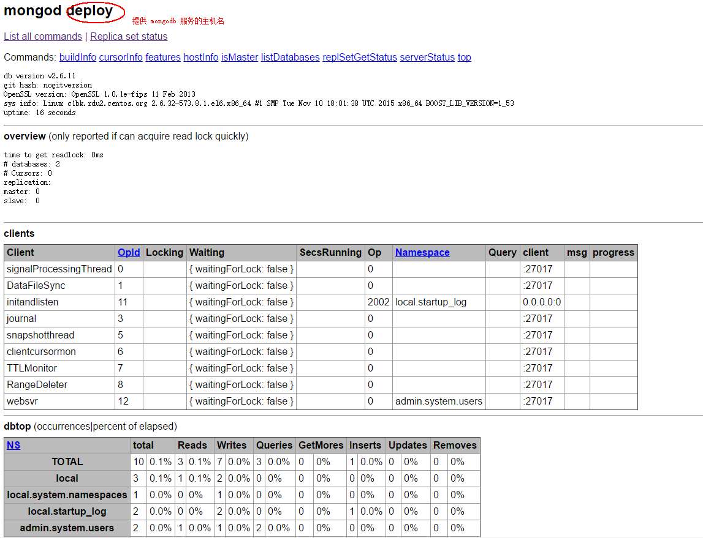

# MongoDB 安装
## 安装
mongodb 安装简单，直接用 yum 装即可。如下所示：
```
$ yum install -y mongodb mongodb-server
```
安装完毕后，会多一个`/var/lib/mongodb`(数据库目录，默认是 /data/db)的目录，以及`/etc/mongod.conf`和`/etc/mongos.conf` 文件。
安装完毕后，执行 mongod 即可启动 mongodb。
> 注：若想使用 **/etc/mongod.conf **作为 mongodb 的配置文件，需要使用 --config /etc/mongodb.conf 参数，否则会由于使用
默认 /data/db 作为数据库目录，而该目录不存在导致启动失败，报错 ERROR: dbpath (/data/db) does not exist.。

## 启动
### 前台方式运行
前台方式运行需要指定配置文件的 fork 值为 false 或指定 --fork 为 false，且指定--fork 必须指定 --logpath 或 --syslog
```
$ vim /etc/mongod.conf
...
fork = false

$ mongod --config /etc/mongod.conf
2018-02-15T07:26:52.144+0000 log file "/var/log/mongodb/mongod.log" exists; moved to "/var/log/mongodb/mongod.log.2018-02-15T07-26-52".
```

### 后台方式运行
```
# 这样会以 Daemon 方式启动 mongodb
$ mongod --config /etc/mongod.conf
about to fork child process, waiting until server is ready for connections.
forked process: 115
child process started successfully, parent exiting

$ ps aux
USER       PID %CPU %MEM    VSZ   RSS TTY      STAT START   TIME COMMAND
root       115  0.9  0.4 410136 37892 ?        Sl   06:42   0:00 mongod --config /etc/mongod.conf
```

## MongoDB Shell
**MongoDB Shell **是MongoDB自带的交互式 **Javascript shell**,用来对MongoDB进行操作和管理的交互式环境。进入mongoDB后台后，
它默认会链接到 **test** 文档（数据库）
```
$ mongo --host 10.158.113.155
MongoDB shell version: 2.6.11
connecting to: 10.158.113.155:27017/test
Welcome to the MongoDB shell.
For interactive help, type "help".
For more comprehensive documentation, see
    http://docs.mongodb.org/
Questions? Try the support group
    http://groups.google.com/group/mongodb-user
Server has startup warnings:
2018-02-10T18:06:31.455+0800 [initandlisten]
2018-02-10T18:06:31.455+0800 [initandlisten] ** WARNING: Readahead for /var/lib/mongodb is set to 4096KB
2018-02-10T18:06:31.455+0800 [initandlisten] **          We suggest setting it to 256KB (512 sectors) or less
2018-02-10T18:06:31.455+0800 [initandlisten] **          http://dochub.mongodb.org/core/readahead
rs0:PRIMARY>
rs0:PRIMARY> quit()
```
> 1. 一般直接执行 mongo 就可以进后台 shell。是否需要指定 --host，根据 mongo.conf 配置中的 bindIp 的值来决定
> 2. 远程连接：使用 --host 参数，也可省略 --host 直接写远程 mongodb server ip地址

## MongoDB WEB 界面
MongoDB 提供了简单的 HTTP 用户界面，要在启动的时候指定参数** --rest**。且若想提供给其他机器使用 WEB 界面，则 bindIp 值不
能是 127.0.0.1，必须是一个可供外网访问的地址。
```
$ mongod --config /etc/mongod.conf --rest
2018-02-15T07:07:55.784+0000 ** WARNING: --rest is specified without --httpinterface,
2018-02-15T07:07:55.784+0000 **          enabling http interface
about to fork child process, waiting until server is ready for connections.
forked process: 112
child process started successfully, parent exiting
```
MongoDB 的默认端口号为 **27017**，而其 WEB 的端口号为 **28017 **= 27017 + 1000.

