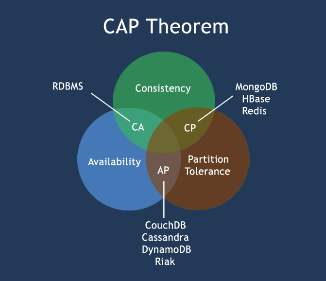

# 简介
属于**NoSQL**(NoSQL = Not Only SQL )数据库的一种,是一个由 C++ 编写、基于**分布式文件存储**的数据库。是**介于**关系数据库和非关系数据库之间的产品，
但是**非关系型数据库**中功能最丰富，最像关系数据库的。Mongodb **支持多种编程语言**，如 _Ruby，Python，Java，C++，PHP，C# 等。其特性包括：
* 无 schema 特性：即数据结构不固定，数据扩展方便
* 高性能与数据压缩：满足大数据存储要求
* TTL索引特性：能自动删除过期数据，确保数据不会无限膨胀

使用场景：
* 监控数据
* 写多读少
* 无事务
* 数据结构不固定

## 概念
MongoDB 和 Elasticsearch、关系型数据库概念对比
```
关系数据库(RDB) ⇒ 数据库  ⇒ 表     ⇒ 行    ⇒ 列
Elasticsearch  ⇒ 索引    ⇒ 类型   ⇒ 文档  ⇒ 字段
MongoDB        ⇒ 数据库  ⇒ 集合   ⇒ 文档  ⇒ 域
```

## MongoDB 数据类型
| **类型** | **说明** |
| --- | --- |
| String | 字符串类型。MongoDB中UTF-8的字符串才合法 |
| Integer | 整型。根据机器，分为32位或64位 |
| Boolean | 布尔型 |
| Double | 双精度浮点型 |
| githubMin/Max keys | 将一个值与 BSON（二进制的 JSON）元素的最低值和最高值相对比 |
| Arrays | 数组 |
| Timestamp | 时间戳 |
| Object | 用于内嵌文档 |
| Null | 用于创建空值 |
| Date | 存储日期时间 |
| Binary Data | 存储二进制数据 |
| Code | 代码类型，用于存储JS代码 |
| Regular expression | 正则式类型，用于存储正则式 |

## RDBMS与NoSQL
RDBMS(关系型数据库管理系统)，高度**结构化**数据，使用**SQL**(结构化查询语言)，遵循**ACID**规则(正是**事务的四特性**)。
* A (Atomicity)：**原子性**，即事务中的**所有操作**要么全部做完，要么都不做。**只要有一个操作失败，整个事务就失败**，就需要回滚
* C(Consistency)：**一致性**，即数据库要一直处于一致的状态，**事务的运行不会改变数据库原本的一致性约束**。如有完整性约束 a+b=10，如果一个事务改变了a，那么
必须得改变 b，使得事务结束后依然满足 a+b=10，否则事务失败。
* I(Isolation)：**独立性**，即**并发的事务之间不会互相影响**，如果一个事务要访问的数据正在被另外一个事务修改，只要另外一个事务未提交，它所访问的数据就不受未
提交事务的影响
* D(Durability)：**持久性**，指一旦事务提交后，它所做的修改将会**永久保存**在数据库上

NoSQL(非关系型数据库)，非结构化，常用于超**大规模**数据存储(如日志存储), 没有限制查询语言，不仅仅是SQL，高性能、高可用、高扩展，遵循**最终一致性**，而不是**ACID**原则，
没有预定义的模式，可以基于键值对存储、列存储、文档存储、图存储等.
* **列存储**：按列存储数据，最大的特点是方便存储结构化和半结构化数据，方便做数据压缩，对针对某一列或者某几列的查询有非常大的IO优势。如 **HBase**
* **文档存储**：用类似 **json **的格式存储，存储的内容是文档型的。如 **Elasticsearch**、**MongoDB**
* **key-value****存储**：可以通过key快速查询到其value。如 **Redis**
* **对象存储**：通过类似面向对象语言的语法操作数据库，通过对象的方式存取数据。如 **Swift**
* **图存储**：图形关系的最佳存储。如 **Neo4J**


**BASE**原则：NoSQL对可用性和一致性的弱要求原则
* **B**asically **A**vailble：基本可用
* **S**oft-state ：软状态/柔性事务。 "Soft state" 可以理解为"无连接"的, 而 "Hard state" 是"面向连接"的
* **E**ventual Consistency：最终一致性 最终一致性， 也是是 ACID 的最终目的。

**CAP**定理：一个分布式系统**不可能同时**很好的满足**一致性**(C)，**可用性**(A)和**分区容错性**(Partition tolerance)，**最多**只能同时较好的满足**两个**
* C：所有节点在**同一时间**具有相同的数据
* A：保证**每个请求**不管成功或者失败**都有响应**
* P：系统中任意信息的丢失或失败不会影响系统的继续运作

根据 CAP 原理将 NoSQL 数据库分成了满足 CA 原则、满足 CP 原则和满足 AP 原则三大类：
* **CA**集群：**单点**集群，通常在可扩展性上不太强大
* **CP**集群：通常性能不是很高
* **AP**集群：通常可能对一致性要求低一些



## 附录
### 监控工具
| 名称 | 描述
| ---- | ----
| Munin | 网络和系统监控工具，它作为一个插件应用于MongoDB中
| Gangila | MongoDB高性能的系统监视的工具，它作为一个插件应用于MongoDB中

### GUI
| 名称 | 描述
| ---- | ----
| Fang of Mongo | Web版,  由Django和jQuery所构成
| Database Master | Windows的mongodb管理工具
| MongoHub | 适用于OSX的应用程序
| RockMongo | PHP语言的MongoDB管理工具，轻量级, 支持多国语言

### MongoDB 命令
| **命令** | **描述** |
| :--- | :--- |
| mongo | 登录命令，利用 mongo 可以登录 mongo 副本、分片集群 |
| mongod | 进程启动命令 |
| mongos | 分片集群命令，通过 mongos 启动 Router |
| mongodump | 用于备份数据，导出数据到指定目录，导出格式为BSON |
| mongorestore | 用于恢复备份数据 |
| mongoexport | 用于将mongodb中的数据库，导出为JSON,CSV或TSV的格式 |
| mongofiles | 用于操作 mongodb 的 GridFS 文件系统 |
| mongoimport | 用于将JSON,CSV或TSV等文件格式，导入到mongoDB数据库中 |
| mongooplog | 用于从运行的mongod服务中拷贝运行日志到指定的服务器，主要用于增量备份 |
| mongoperf | MongoDB IO测试工具 |
| mongosniff | 监控连接到 MongoDB 的TCP/IP 连接，类似于 tcpdump |
| mongostat | mongodb监控工具，获取mongodb的当前运行状态 |
| mongotop | mongodb监控工具，用来跟踪一个MongoDB的实例，查看哪些大量的时间花费在读取和写入数据 |

## 参考文献
1. [菜鸟教程 mongodb](http://www.runoob.com/mongodb/mongodb-linux-install.html)
2. [MongoDB工具介绍](http://www.cnblogs.com/tangxiaojun/p/4988423.html)
3. [MongoDB分片搭建](https://my.oschina.net/aven92/blog/514669)
4. [搭建高可用mongodb集群（四）—— 分片](http://www.lanceyan.com/tech/arch/mongodb_shard1.html)
5. [Mongodb 实战教程](http://www.ttlsa.com/mongodb/mongodb-study/)
6. [Mongodb 官方监控--MMS](http://www.ttlsa.com/mms/follow-me-to-use-mongodb-mms-services/)