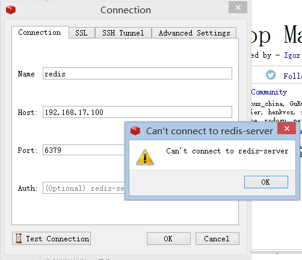
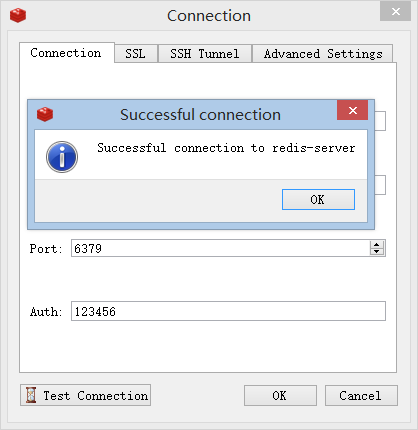

# FAQ
## 1.zmalloc.h:50:31: 致命错误：jemalloc/jemalloc.h：没有那个文件或目录
**场景**：按照官网执行 make 命令时，出现如下错误
```
make[1]: 进入目录“/share/redis-3.2.9/src”
   CC adlist.o
In file included from adlist.c:34:0:
zmalloc.h:50:31: 致命错误：jemalloc/jemalloc.h：没有那个文件或目录
#include <jemalloc/jemalloc.h>
```
**解决**：改为执行 `make MALLOC=libc` 命令

## 2.远程登录失败，连接被拒绝
**场景**：VM 内安装完 redis 后，使用 Redis Deskt Manager 进行远程登录，连接被拒绝（利用 Java 程序也失败）



**原因**：Redis 默认只允许本地访问，若想在其他主机访问远程 redis 服务，则必须配置 redis 开启远程访问

**解决**：修改 redis.conf 文件，开启远程访问
```
$ mkdir /etc/redis/redis.conf
$ cp src/redis.conf /etc/redis/redis.conf

$ vim redis.conf
# bind 127.0.0.1                    # 注释掉改配置，若不注释，则表示只能本地访问
requirepass 123456                  # 设置认证密码，用于安全控制

# 重启 redis
$ redis-server /etc/redis/redis.conf &

# cli 测试
$ redis-cli -h 192.168.17.100       # 没有进行认证，无法操作数据库
192.168.17.100:6379> get k01
(error) NOAUTH Authentication required.

$ redis-cli -h 192.168.17.100 -a 123456
192.168.17.100:6379> get k01
"\"v01\""
```
