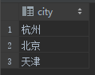

# distinct
## 一、概述
distinct 关键字用于去除重复值.
```
SELECT DISTINCT column_name FROM table_name
```

## 二、案例
PERSON 表原始数据:   


去除 person 表中 city 值重复的数据
```
SELECT DISTINCT city FROM person;
```
结果集：  

> 说明: 若是 DISTINCT column_1, column2，则必须 2 列值都重复的，才会去掉