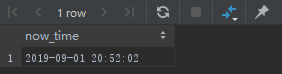
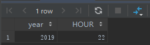

# 函数
## 一、日期
函数 | 描述 | 示例
---- | ---- | -----
NOW() | 返回当前日期时间, 格式 YYYY-MM-DD HH:MM:SS | `SELECT now() as now_time;`
CURDATE() | 返回当前日期, 格式 YYYY-MM-DD |
CURTIME() | 返回当前时间，格式 HH:MM:SS |
DATE(date_str) | 提取日期时间表达式的日期部分, YYYY-MM-DD 或 YYYY/MM/DD | `SELECT date('2019-08-01 22:00:00') as now_time;`
EXTRACT(unit FROM date) | 提取日期/时间单独部分, unit 是时间单位 | 
DATE_ADD(date, INTERVAL expr unit) | 日期加法, expr 是添加的时间间隔, unit 是时间单位 | `SELECT DATE_ADD('2019-08-21', INTERVAL 20 DAY ) as result;` 
DATE_SUB(date, INTERVAL expr unit) | 日期减法 |
DATEDIFF(date1, date2) | 计算 2 个日期间的天数
DATE_FORMAT() | 日期格式化 |   


```
SELECT current_timestamp() as now_time;
```


```
SELECT extract(year FROM '2019/08/02 22:00:00') AS year, 
       extract(hour FROM '2019/08/02 22:00:00') AS hour;
```


## 二、字符串
concat(): 字符串拼接
```
SELECT CONCAT(first_name, last_name) as name FROM person;
```