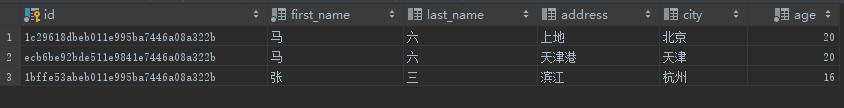
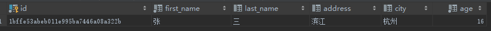

# Having
## 简介
用于指定过滤条件，与 WHERE （作用于被选择列）不同，Having 作用于 Group By 产生的组。

## 案例
原始数据表  


按 city 进行分组
```
SELECT * FROM person GROUP BY city
```
结果集如下：    


统计出现次数 `>=` 2 的记录
```
SELECT * FROM person GROUP BY city HAVING count(city) >= 2; 
```
结果集如下：  
