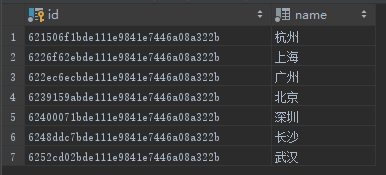
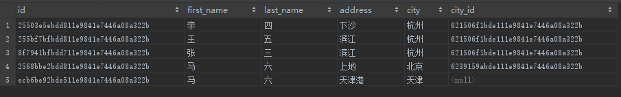
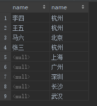
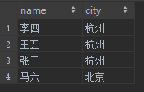

# 连接
## left join
左外连接，亦或 left outer join，返回左表中的所有行，即使右表中没有匹配得行。
```
SELECT
   column1, column2...
FROM
    tb1
LEFT JOIN
    tb2
ON
    tb1.id = tb2.id
```

"PERSON" 表  


"CITY" 表  


列出所有的人，以及他们所住城市的 id
```
SELECT 
    person.*, city.id AS city_id 
FROM 
    person 
LEFT JOIN 
    city 
ON 
    person.city = city.name;
```  
结果集：  


## right join
右外连接，亦或 right outer join，返回右表中的所有行，即使左表中没有匹配得行。
```
SELECT
   column1, column2...
FROM
    tb1
RIGHT JOIN
    tb2
ON
    tb1.id = tb2.id
```

列出所有的城市，以及住在城市里的人
```
SELECT
    concat(first_name, last_name) as name, city.name
FROM
    person
RIGHT JOIN
    city
ON
    person.city = city.name;
```
结果集：  


## inner join
内连接，表中有至少一个匹配，则返回行。*INNER JOIN 跟 JOIN 是一样的*
```
SELECT
   column1, column2...
FROM
    tb1
INNER JOIN
    tb2
ON
    tb1.id = tb2.id
```

列出有住民的城市，以及其住户
```
SELECT
    concat(first_name, last_name) as name, city.name as city
FROM
    person
INNER JOIN
    city
ON
    person.city = city.name;
```
结果集：  


## full join
全连接，左右两表的内容全部返回。
```
SELECT
   column1, column2...
FROM
    tb1
FULL JOIN
    tb2
ON
    tb1.id = tb2.id
```
