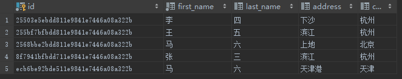
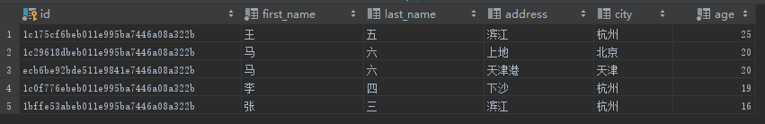

# ORDER BY
## 概览
order by 用于对结果集根据指定列进行排序，默认是升序 ASC，也可以指定降序（DESC）排序。

## 案例
原始 PERSON 表



执行以下 SQL 语句，给 person 添加一列
```
ALTER TABLE person ADD age integer NOT NULL DEFAULT 1;
UPDATE person SET age = 20 WHERE first_name = '马';
UPDATE person SET age = 19 WHERE first_name = '李';
UPDATE person SET age = 16 WHERE first_name = '张';
UPDATE person SET age = 25 WHERE first_name = '王';
```

以升序显示 address，以降序显示 age
```
SELECT * FROM person order by age DESC, address;
```
结果集：  
