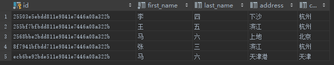
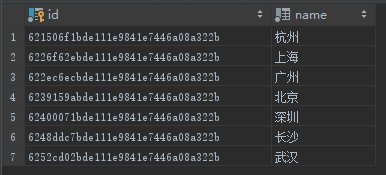

# 子查询
## 一、概述
子查询，亦被称作内查询、嵌套查询，是嵌套在其他 SQL 查询中 `WHERE` 字句中的查询。可使用在 `update & select & insert & delete` 
语句中，跟 `=, >, >=, in, between`等运算符使用。子查询规则如下：
* 使用`()`进行包裹。
* 只能有 1 个列，除非主查询有多个列，来与子查询的列进行比较。
* 无法使用 ORDER BY。
* GROUP BY 在子查询中可起到 ORDER BY 相同的作用。
* 返回多行数据的子查询，其结果集只能与多值操作符（如 IN）配合使用。
* 不能包含任何对 BLOB，ARRAY，CLOB，NCLOB 类型值的引用。
* 不能直接用在集合函数中。
* BETWEEN 不能跟子查询一起使用，但可以用在子查询中。

## 二、案例
### 2.1 与 SELECT 配套
子查询一般都与 SELECT 使用
```
SELECT 
    column_name [, column_name ]
FROM   
    table1 [, table2 ]
WHERE  
    column_name OPERATOR
    (SELECT 
        column_name [, column_name ]
    FROM table1 [, table2 ]
    [WHERE])
```

PERSON 表  


CITY 表  


查询居住城市收录在 city 表中的人
```
SELECT * FROM person as p 
WHERE p.city in (SELECT city.name FROM city);
```
结果集：  


### 2.2 与 INSERT 配套 
INSERT 语句可将子查询返回的数据插入到其他表中
```
INSERT INTO table_name 
SELECT * FROM table1 [, table2]
WHERE VALUE OPERATOR 
        (SELECT 
            column_name [, column_name ]
        FROM table1 [, table2 ] WHERE condition)
```

将城市信息插入 city_bk 表中
```
CREATE TABLE city_bk (
  name VARCHAR(50) NOT NULL
);

INSERT INTO city_bk
SELECT name FROM city WHERE name in (SELECT city FROM person);

SELECT * FROM city_bk;

DROP TABLE city_bk;
```
结果集：  


> 说明：执行 INSERT INTO city_bk SELECT name FROM city; 也是可以的，不过这就没有包含子查询了，子查询得是在 WHERE 字句中。

### 2.3 与 UPDATE 配套
同 UPDATE 一起使用时，既可更新单列，也可更新多列属性值
```
UPDATE 
    table_name 
SET 
    column_name = new_value
WHERE 
    OPERATOR [ VALUE ]
   (SELECT column_name FROM table_1 WHERE condition)
```

将住址收录在 city 表中居民 fist_name 的值赋值给 last_name
```
UPDATE person SET first_name = last_name WHERE city IN (SELECT name FROM city);
SELECT * FROM person;
```
结果集：  


### 2.4 与 DELETE 配套
与 DELETE 一起使用
```
DELETE FROM table_name
WHERE 
    OPERATOR [ VALUE ]
   (SELECT column_name FROM table_1 WHERE condition)
```

清除住址收录在 city 表中的居民信息
```
DELETE FROM person WHERE city in (SELECT name FROM city);
SELECT * FROM person;
```
结果集：  
