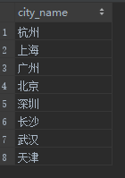
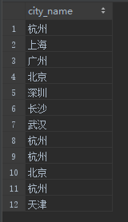

# union
## 一、概述
union 用于合并两个或多个 SELECT 语句的结果集，只取*不同*的值，union all 则结果集中允许重复的值。
* 2 个 SELECT 语句中列的数量，必须一致，且数据类型一致
* union 结果集的列名是第一个 SELECT 语句中的列名
```
SELECT column_1 FROM tb1
UNION
SELECT column_2 FROM tb2
```

## 二、案例
列出所有的城市: 无重复值
```
SELECT city.name as city_name FROM city
UNION
SELECT person.city FROM person;
```
结果集：  


列出所有的城市: 允许重复值
```
SELECT city.name as city_name FROM city
UNION ALL
SELECT person.city FROM person;
```
结果集：  
