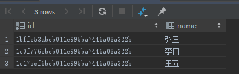

# 视图
## 一、简介
视图 view 是基于 SQL 结果集的可视化表，**是存储在 DB 中具有名字的 SQL 语句**。
* 视图总是显示**最新**数据
* 每次查询视图，引擎会**重新执行**视图的 SQL 构建数据
* 可以查询或更新视图的数据：支持 SELECT、UPDATE、INSERT、DELETE 语句

创建或更新视图
```
CREATE OR REPLACE VIEW view_name AS
SELECT column_name FROM table_name
WHERE condition
WHIT CHECK OPTION
```
> Note: 
> * 可以使用 OR REPLACE 来更新视图
> * WITH CHECK OPTION 用于保证 UPDATE 和 INSERT 操作都满足视图定义中 WHERE 的条件，不满足的操作，将返回错误。

删除视图
```
DROP VIEW view_name;
```

## 二、案例
```
CREATE VIEW view_hz_persons AS
SELECT
    id, CONCAT(first_name, last_name) as name
FROM
    person
WHERE city = '杭州';
```


```
SELECT * FROM view_hz_persons;
```
