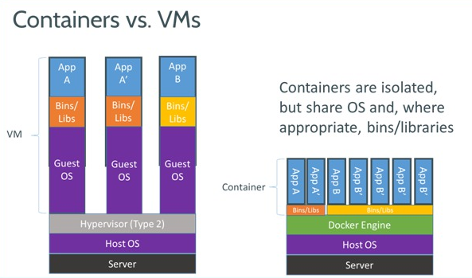
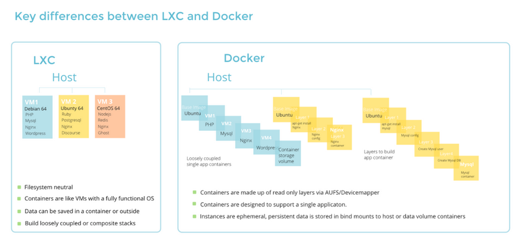

# Docker
## 一、简介
Docker 是一款开源的使用 GO 语言实现的 C/S 架构的**轻量级容器引擎**，基于 LXC(目前使用  libcontainer) 和 cgroups 来实现资源的隔离,其目标是**实现轻量级的操作系统虚拟化解决方案**。
1. Docker 是OS 级虚拟化方案，不属于全虚拟化、半虚拟化、部分虚拟化，也不是硬件虚拟化的方案
2. cgroups是容器实现CPU，内存等资源隔离的基础

安装方法很简单，如下所示：
```
# 1.10版本
$ yum install -y docker
# 1.12 版本
$ yum install -y docker-engine
```
优点：
* **资源利用率高**：一台主机上可以同时运行数千个 Docker 容器
* **秒启动**
* **高性能、低消耗**：容器除了运行其中应用外，基本不消耗额外的系统资源。且容器可以随时启动，随时销毁
* **高效虚拟化**：容器的运行**不需要额外的 Hypervisor 支持**，它是**内核级的虚拟化**(VM需要 Hypervisor 支持)
* **跨平台**：容器几乎可以在任意的平台上运行

缺点：
* 只能用在 **64 **位的操作系统上：因为 Docker 是基于 Linux 64bit
* 容器的 **Guest 系统只能是基于 Linux** 的：因为 LXC 是基于 cgroup 等 Linux kernel 功能实现的

## 二、Docker 与 VM、LXC的区别
Docker 与 VM 的比较图如下：



Docker 与 LXC 的比较图如下：



| **特征** | Docker | VM | LXC |
| :--- | :--- | :--- | :--- |
| 隔离性 | 基于进程/镜像的隔离 | 强隔离，资源的完全隔离 | 基于进程的隔离 |
| 虚拟化方案 | OS 级虚拟化方案 | 服务器、桌面级虚拟化方案 | OS级虚拟化方案 |
| 量级 | 轻量 | 重量 | 轻量 |
| 内核 | 共享宿主机OS | 使用独立的内核 | 共享宿主机OS |
| 硬盘使用 | MB级 | GB级 |  |
| 单机规模 | 单机支持成百上千的容器 | 一般为几十个 |  |
| 启动速度 | 秒启动 | 分钟启动 | 秒启动 |
| 应用承载 | 一般一个容器一个应用进程 | 一个VM启动多个应用 | 一个LXC容器负责多个应用 |

> Docker 底层基于 LXC 来实现