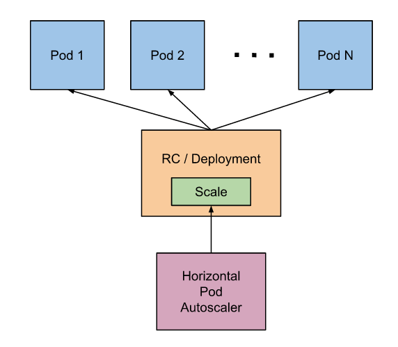

# Deployment
## 一、简介
deployment 也是 rc 的一种变体，其优点是扩展性高，可以进行滚动升级，可以使用 kubectl 命令有效控制 pod 的副本数。
不过其 rollout 只有在 pod 模板被修改时才会触发，如更新 labels、images，其他的改变，如扩容，是不会触发 rollout 的。

deployment, rc, rs 的横向扩容，支持横向扩容特性的 api 有 2个：
*  稳定版本：autoscaling/v1
*  测试版本：extensions/v1beta1



## 二、案例
```
```
$ vim nginx-deployment.yaml
apiVersion: extensions/v1beta1
kind: Deployment
metadata:
  name: nginx-deployment                     # 名
spec:
  replicas: 3                                # 副本数
  template:
    metadata:
      labels:
        app: nginx                           # 标签
    spec:
      containers:
      - name: nginx                          # 容器名
        image: nginx
        imagePullPolicy: IfNotPresent        # 镜像获取策略
        ports:
        - containerPort: 80                  # 暴露的端口

$ kubectl get deployment
NAME               DESIRED   CURRENT   UP-TO-DATE   AVAILABLE   AGE
nginx-deployment   3         3         3            3           11s

# 查看 replica set
$ kubectl get rs
NAME                          DESIRED   CURRENT   AGE
nginx-deployment-2629547101   3         3         16s

kubectl get pod --show-labels
NAME                                READY     STATUS    RESTARTS   AGE       LABELS
nginx-deployment-2629547101-nlegp   1/1       Running   0          2m        app=nginx,pod-template-hash=2629547101
nginx-deployment-2629547101-pqkgt   1/1       Running   0          2m        app=nginx,pod-template-hash=2629547101
nginx-deployment-2629547101-qxmy1   1/1       Running   0          2m        app=nginx,pod-template-hash=2629547101

# 检查 deployment 是否创建成功
$ kubectl rollout status deployment/nginx-deployment
deployment nginx-deployment successfully rolled out

# 升级 deployment：镜像的更换
$ kubectl set image deployment/nginx-deployment nginx=nginx:1.9.1
deployment "nginx-deployment" image updated
```