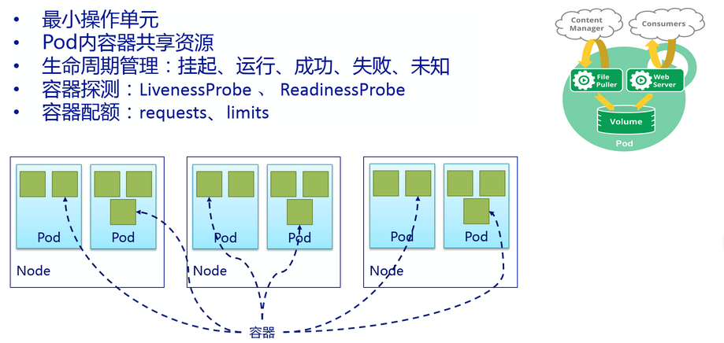

# Pod
## 一、简介
pod 是 k8s 的**基本操作单元**，由 1 个或多个容器组成，且一般同一 pod 中的容器运行相同的应用。



pod 的特性：
* **无状态**： 重启后，新的 pod 其内数据是新的。解决办法：使用 pv 挂卷存储数据
* **ip 不固定**：当 pod 失败，然后被重建后，pod 内容器的 ip 会被重新分配

pod 的状态/生命周期：
* 挂起：Pod 已被提交到Master，但容器尚未创建。包括调度和下载镜像，需要一段时间
* 运行：Pod 已绑定到节点，和所有容器已创建完成。至少一个容器是仍在运行，或正在启动或重新启动
* 成功：Pod 中所有容器已经成功的终止，并不会重新启动
* 失败：Pod 中所有容器已经都终止，至少一个容器已都终止失败
* 未知：出于某种原因的Pod状态无法获得，通常由于与主机的Pod通信错误导致

## 二、案例
在 k8s 中，所有资源的创建都可以通过编写 yaml 资源文件来实现，当然都会有各自的语法格式。如下所示创建一个基于 centos 镜像启动
命令为打印一句话的 pod。
```
$ vim pod-centos.yaml
apiVersion: v1
kind: Pod                               # 资源类型
metadata:
  name: centos                          # pod 名
spec:
  containers:                           # 定义 pod 内的容器：一个或多个
  - name: centos                        # 容器名为 centos
    image: centos                       # 镜像
    imagePullPolicy: IfNotPresent       # 获取镜像的策略：若不存在，则 pull
    command: [ "echo", "SUCCESS"]

$ kubectl create -f pod-centos.yaml

$ kubectl get pod
NAME                                READY     STATUS      RESTARTS   AGE
centos                              0/1       Completed   1          10s

$ kubectl logs centos
SUCCESS
```
> imagePullPolicy 的策略有：IfNotPresent、Always、Never

在集群环境下，若想让 pod 在指定节点上启动，可以使用  nodeSelector，并可以使用 hostNetwork 指定使用主机网络。

> 一个 pod 只能定义一个 nodeSelector
```
apiVersion: v1
kind: Pod
metadata:
  name: centos
spec:
  containers:
  - name: centos
    image: centos
    imagePullPolicy: IfNotPresent
    command: [ "sh", "-xec"]
    args:
      - echo "SUCCESS"
  restartPolicy: OnFailure              # 重启策略
  hostNetwork: True                     # 使用主机网络
  nodeSelector:
    controller: 'true'                  # 标签为 controller='true' 的节点上创建该 pod
```

定义带有多个容器的 pod：
```
apiVersion: v1
kind: Pod
metadata:
  name: centos
spec:
  containers:
  - name: centos
    image: centos
    imagePullPolicy: IfNotPresent
    command: [ "sh", "-xec"]
    args:
      - echo "SUCCESS"
  - name: centos7
    image: centos7
    imagePullPolicy: IfNotPresent
    command: ["sh", "-xec"]
    args:
      - echo "I am centos7";
        echo "${NAME}";
        echo "${PWD}";
    env:                                  # 注入环境变量给 centos7 容器使用
    - name: NAME
      value: "bascker"
    - name: PWD
      value: "123456"
```

openstack集群中 consul 组件 pod：
```
$ k8s get po -o wide | grep consul
consul-client-7x88p                   2/2       Running   6          6d        10.158.113.44   node4
consul-client-psdr1                   2/2       Running   0          6d        10.158.113.45   node5
consul-client-qnrwl                   2/2       Running   2          6d        10.158.113.46   node6
consul-ha-compute-81ln8               1/1       Running   1          6d        10.158.113.42   con2
consul-ha-compute-j6vwh               1/1       Running   1          6d        10.158.113.43   con3
consul-ha-compute-x5thg               1/1       Running   1          6d        10.158.113.41   con1
consul-server-1x448                   2/2       Running   3          6d        10.158.113.43   con3
consul-server-6tl1f                   2/2       Running   2          6d        10.158.113.41   con1
consul-server-8x59l                   2/2       Running   2          6d        10.158.113.42   con2

$ k8s get ds | grep consul
consul-client                3         3         3         compute=true               6d
consul-ha-compute            3         3         3         consul_server=true         6d
consul-server                3         3         3         consul_server=true         6d
```