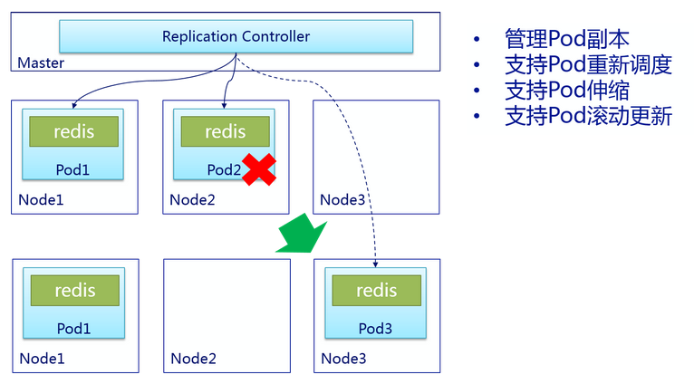

# RC
## 一、简介
rc 是 repliction controller 的简称，其核心作用是确保 pod 高可用，即在 k8s 环境下始终有指定数量的 pod 在运行。
* 若当前环境 pod 数少于指定 rc 数，则自动创建新的 pod
* 若当前环境 pod 数多于指定 rc 数，则自动销毁部分 pod
> 建议不要直接创建单一的 pod，而是使用 rc 来创建，保证 pod 的可用性



## 二、案例
创建副本数为 1 的 nginx
```
$ vim nginx-rc.yml
apiVersion: v1
kind: ReplicationController                      # 资源类型
metadata:
  labels:
    service: nginx
  name: nginx
spec:
  replicas: 1                                    # 副本数
  selector:
    service: nginx
  template:
    metadata:
      labels:
        service: nginx
    spec:
      containers:
      - name: nginx
        image: 192.168.1.158/docker.io/nginx
        imagePullPolicy: IfNotPresent
        ports:
        - name: http
          containerPort: 80
          protocol: TCP
      restartPolicy: Always

$ kubectl create -f nginx-rc.yml
replicationcontroller "nginx" created

$ kubectl get pod
NAME          READY     STATUS    RESTARTS   AGE
nginx-rjp2h   1/1       Running   0          22s
```