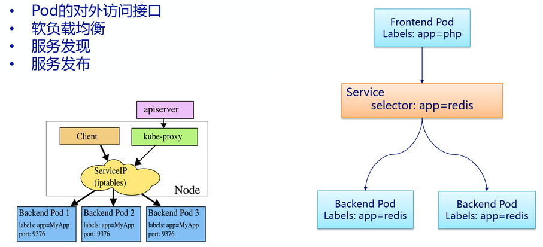

# Service
## 一、简介
service(简称 svc)  可以看作一组提供相同服务的Pod的对外接口,通过LabelSelector选择一组Pod作用后端服务提供者。通过 service
可以访问提供相同服务的一组 pod， 每一个服务后面都有很多对应的容器来支持。



[Q] 为什么需要 service？

[A] service 的出现正是为了解决 pod 中容器 ip 不固定的问题。Pod 的 IP 是由 Docker Daemon 根据 docker0 网桥的 IP 地址段进行
分配的，但 Service 的 Cluster IP 地址是 Kubernetes 系统中的虚拟IP地址，由系统动态分配(kube-proxy 负责对Service实现虚拟IP的
实现)。svc 的 cluster ip 相对于Pod的IP地址来说相对稳定，Service被创建时即被分配一个IP地址，在销毁该Service之前，这个IP地址都
不会再变化了。而Pod在Kubernetes集群中生命周期较短，可能被Replication Controller销毁、再次创建，新创建的Pod就会被分配一个新的
IP地址，因此需要一个 svc 来提供稳定的访问 pod 服务的对外接口。

svc 的作用：
* 对外：提供稳定的访问pod服务的接口
* 对内：负载分担， 通过 Proxy 的 port 和服务 selector 决定服务请求传递给后端提供服务的容器

> kube-proxy 借助 iptables 实现 Pod 和 Service 间通信

## 二、案例
创建一个提供 nginx 服务的 svc：此时环境中已经存在 3 个 nginx 服务的 pod
```
$ vim nginx-svc.yml
apiVersion: v1
kind: Service
metadata:
  name: nginx
spec:
  ports:
  - name: nginx
    port: 80                                          # 监听 80 端口
    protocol: TCP
  selector:
    service: nginx

$ kubectl create -f nginx-svc.yml
service "nginx" created

$ kubectl get svc
NAME         CLUSTER-IP   EXTERNAL-IP   PORT(S)   AGE
nginx        20.0.25.88   <none>        80/TCP    6s

# 访问 80 服务
$ telnet 20.0.25.88 80
Trying 20.0.25.88...
Connected to 20.0.25.88.
Escape character is '^]'.

$ curl 20.0.25.88
<!DOCTYPE html>
<html>
<head>
<title>Welcome to nginx!</title>
<style>
    body {
        width: 35em;
        margin: 0 auto;
        font-family: Tahoma, Verdana, Arial, sans-serif;
    }
</style>
</head>
<body>
<h1>Welcome to nginx!</h1>
<p>If you see this page, the nginx web server is successfully installed and
working. Further configuration is required.</p>

<p>For online documentation and support please refer to
<a href="http://nginx.org/">nginx.org</a>.<br/>
Commercial support is available at
<a href="http://nginx.com/">nginx.com</a>.</p>

<p><em>Thank you for using nginx.</em></p>
</body>
</html>
```
svc 负载分担的分析：
* 对于该 nginx 的 svc，k8s  会为其创建一个本地集群的DNS入口， 因此只需要DNS查找主机名为 nginx，就能够解析出前端应用程序可用的IP地址
* nginx 这个 svc  会在 3 个pod中提供透明的负载均衡，将请求分发给其中的任意一个：通过每个Node上运行的 kube-proxy 完成