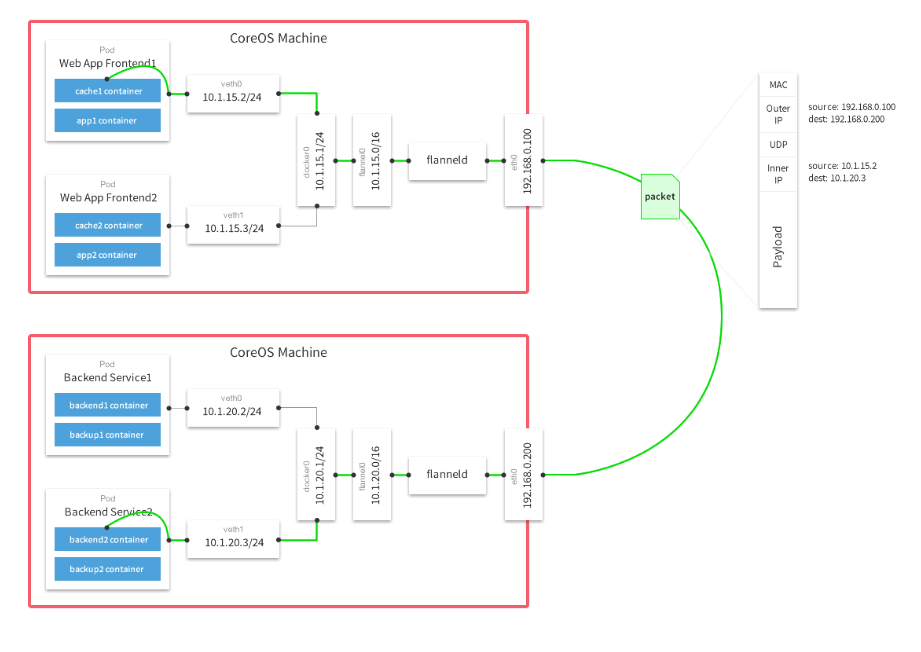

# Flannel 网络
## 一、简介
在Container Cloud环境中，跨机器的容器互连一直是讨论的热点；Kubernetes的官方网站也提供了几种备选方案
* L2网络
* Flannel
* OpenVSwitch
* and so on

> k8s本身不提供网络方案，而是使用 flannel、ovs等作为网络插件来解决跨主机容器互连的问题

[flannel](https://github.com/coreos/flannel) 是CoreOS团队针对Kubernetes设计的一个开源网络规划服务，是一种 Overlay 网络，可以让集群中的不同节点主机创建的Docker容器都具有全集群唯一的虚拟IP地址，
并使Docker容器可以互连，以解决跨主机容器访问问题。

## 二、网络设计
1. Etcd 搭配：为了创建全局唯一的IP地址，Flannel 用 Etcd 来存储每台机器的上子网地址。因此 Flannel 需要搭配 etcd 来使用，生产环境下更是需要部署一个 etcd 集群。
2. 子网划分：：Flannel 使用 CIDR 来对子网进行划分，并可以配置多个子网。
3. docker0 网桥配置：Flannel 会为不同 node 的 docker 网桥配置不同 IP 段以保证 docker 容器的 IP 在集群内唯一，因此flannel会重新配置docker0网桥。

