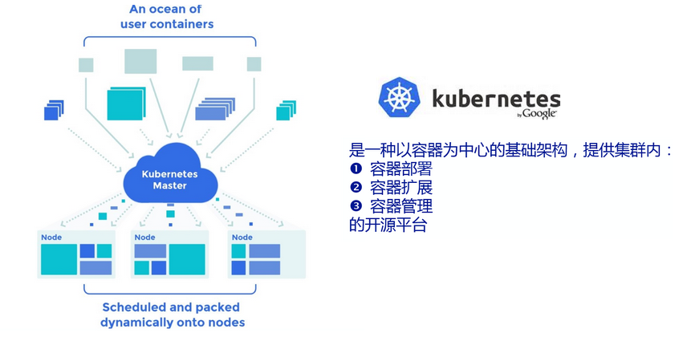

# Kubernetes
Google 开源的 Master/Slave 结构的容器管理系统，简称 k8s。k8s 原生支持 Docker，提供应用部署、维护、 扩展机制等功能,
 主要功能如下所示：
* 管理容器生命周期：创建、销毁、重建等
* 可跨主机管理容器，解决跨主机容器间通信问题
* 保证容器的高可用
* 提供调度、容灾、扩容、缩容、滚动升级(rolling upgrade)等功能

> 滚动升级基本思想：创建复本为1的新的rc，逐步减少老 rc 复本数，增加新 rc 复本数，当老的rc数量为0时将其删除

