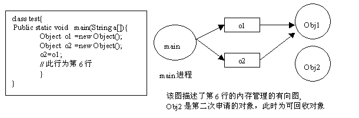
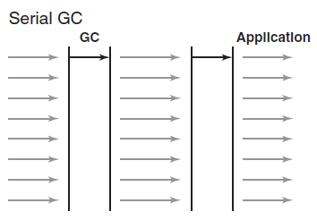
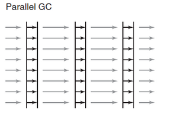
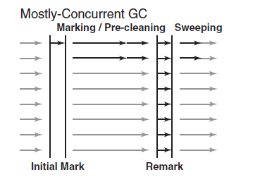

# GC
## 一、简介
Java的内存管理就是对对象的管理(分配和释放)，Java GC机制就是用于回收内存垃圾的。当 Java 中一个对象的**引用被置为 null 后**，程序将无法访问该对象，
这些对象就是不可达对象，GC 将会自动去回收该垃圾(并不会立即回收)。
> 注：引用置空，但实际上分配给该对象的内存空间还存在，只是无法再去访问到该内存片

## 二、基本原理
对于 GC，当程序员创建对象时，就开始监控该对象的地址、大小以及使用情况。通常，GC通过**有向图的方式**记录和管理堆中的所有对象。通过**有向图**的方式
确定哪些对象是可达，哪些对象是不可达的。当发现有对象不可达时，就有责任去回收它(**并不会立即回收**)。举例说明如何用有向图表示内存管理，如下就是程序
运行到第6行的示意图.


> Java 使用**有向图的方式**进行内存管理，可以消除引用循环的问题。例如有 3 个对象，相互引用，只要它们和根进程不可达的，那么 GC 也是可以回收它们的。
这种方式的优点是管理内存的精度很高，但是效率较低。

**为了保证 GC 的跨平台，Java 规范并未对 GC 做出明确规定**，没有明确指出使用哪种垃圾回收算法，没有明确指出什么时候进行垃圾回收，致使不同 JVM 实现
者往往有不同的实现，带来程序的不确定性。

**GC在JVM中一般是一个或一组进程来实现**，本身和普通用户程序一样，**占用heap空间和CPU**。

## 三、缺点
1. 当 GC 进程运行时，Java 应用程序需要停止运行(STW)：因此当 GC 运行时间较长时，用户会明显感受到Java程序的停顿，导致用户体验差。
2. 若 GC 运行时间太短，垃圾回收将不够干净，导致内存的浪费。

> **stop-the-world**：不论哪种语言，Java 或 Python，使用传统 GC 算法时，当 GC 正在运行时，应用程序都会停止运行。

## 四、垃圾回收算法
### 4.1 引用计数法
**原理**：每个对象都含有一个引用记数器，当有引用连接至对象时，引用计数加 1。当引用离开作用域或被置为 null 时，引用计数减 1。垃圾回收器会在含有全部对象的列表上
遍历，当发现某个对象的引用计数为0时，就释放其占用的空间。

**缺点**：简单但速度慢的GC算法，**最大问题就在于循环引用问题**。常用来说明垃圾收集的工作方式，似乎从未被应用于任何一种Java虚拟机实现中。

### 4.2 标记清除法
**原理**：从堆栈和静态存储区出发，遍历所有的引用，进而找出所有存活的对象。每当它找到一个存活对象，就会给对象设一个标记，这个过程中不会回收任何对象。**只有全部
标记工作完成的时候，清除动作才会开始**。在清除过程中，**没有标记的对象将被释放**，不会发生任何复制动作。

**缺点**：标记和清除效率也不高；且清除完毕后，剩下的堆空间是不连续的。要是希望得到连续空间的话，就得重新整理剩下的对象。

### 4.3 标记整理法
**原理**：先标记所有可以回收的区域，然后不是直接回收，而是把所有存活的对象都移动到一端，然后直接清理掉端边界以外的区域。

**优点**：一次GC回收后，所剩下的内存空间是连续的。

**缺点**：效率也不高。

> **“标记清除”和“标记整理”算法常用于老年代的回收**。因为老年代存放的对象存活的时间较长，且回收频率不如新生代频繁。

### 4.4 复制算法
**原理**：将整个空间划分2个相等的区域，每次只使用其中一个区域。当一块内存不够时，就将活着的对象复制到另一块内存，然后将第一块的内存全部回收。

**优点**：每次对整个半区回收，不会有内存碎片的情况，实现简单，运行高效。**现在商用的虚拟机都采取复制算法**，但不按 1:1 划分，而是将内存划
分为 1 块较大的 **Eden**区(new 一个对象是就是在这里面分配空间) 和 2 块**Survivor**区域，每次使用 Eden 和 1 块 Survivor。 当回收的时候，
将 Eden 和 Survivor 区中还存活的对象一次性赋值到另一块 Survivor 中，最后清理掉原来使用过的 Eden 和 Survivor 区。
> **“复制”算法常用于新生代的回收**。Eden区和 survivor 区也被称为新生代

**缺点**：内存大小缩小为原来的一半。

## 五、分代收集策略
在面向对象编程语言中，绝大多数对象的生命周期都非常短。分代收集的基本思想是，将堆划分为两个或多个称为**代**的空间。如Java中就分为新生代和老生代。

| **特征** | **新生代** | **老生代** |
| :--- | :--- | :--- |
| **概念** | **大部分**对象在此分配，存放小对象以及生命期短的对象 | **大对象会在此分配**，且随着GC的重复执行，生命周期较长的对象，晋升为老年代 |
| **生命周期** | 短 | 长 |
| **回收速度** | 快，比老生代快几个数量级 | 慢 |
| **回收频率与效率** | 高 | 低 |
| **回收算法** | 复制算法 | 标记-整理算法，标记清除算法 |

> Permanaent Generation 为持久代，从 jdk1.6+ 后已经取消

## 六、Java 程序与 GC 的交互
Java2增强了内存管理功能，增加了一个`java.lang.ref`包，其中定义了 3 种引用类。这 3 种引用类分别为`SoftReference`(软引用)、`WeakReference`(弱引用)和
`PhantomReference`(虚引用)。通过使用这些引用类，程序员可以在一定程度与GC进行交互，以便改善GC的工作效率。

| **特征** | **StrongReference** | **SoftReference** | **WeakReference** | **PhantomReference** |
| :--- | :--- | :--- | :--- | :--- |
| 描述 | 最普遍的引用，new出来的对象都持有强引用 | 软引用 | 弱引用 | 虚引用并不会决定对象的生命周期 |
|  java.lang.ref | 不属于 | 属于 | 属于 | 属于 |
| 生命周期 | 长 | 短暂 | 更短 | 超短，形同虚设 |
| 回收时间 | 若对象具有强引用，那GC绝不会回收它。**即使内存不足，JVM宁愿抛出OutOfMemoryError，也不回收其内存** | 如果一个对象只具有软引用，则内存空间足够，垃圾回收器就不会回收它；**如果内存空间不足，就回收**软引用对象的内存。**常用于实现对内存敏感的高速缓存。 ** | 一旦发现具有弱引用的对象，**无论内存空间是否足够，都将回收它的内存** | 如果一个对象仅持有虚引用，那么它就和没有任何引用一样，**在任何时候都可能被GC回收** |

### 6.1 创建一个引用对象的流程
1 创建一个普通对象持有普通引用
```
Image image=new Image();                     // 创建一个普通对象，持有普通引用
...                                          // 正常使用该对象
```

2.创建一个 SoftRefere 对象引用该对象
```
SoftReference sr=new SoftReference(image);   // 使用完毕后，设置为软引用
```

3.释放该对象的普通引用
```
image = null;                                // 释放该对象的强引用
```

### 6.2 使用一个引用对象的流程
1.创建引用对象

2.再次使用持有软引用的普通对象
```
if (sr != null) {                            // 判断该对象是否存在
   image = sr.get()
} else {
   image = new Image();                     // 由于内存低，已释放该 image 对象，需要重新创建
}
```

## 七、GC回收器与回收类型
> 以 Hotspot VM 为例
### 7.1 回收类型
1. mirror gc：针对**年轻代**对象进行GC操作。
2. major gc：也称作 **full gc**，针对**老年代**对象进行GC操作, 很少发生操作，但一旦执行，就比较耗时，尤其在 heap 很大的情况下。

> **mirros gc** 和 **major gc** 都是要暂停应用的

| **特征** | **mirror gc** | **major/full gc** |
| :--- | :--- | :--- |
| 描述 | 回收类型的一种，针对**年轻代** | 回收类型的一种，针对**老年代** |
| STW | 是 | 是 |

### 7.2 回收器
#### 7.2.1 Serial GC
当**Java 应用启动时**如果加入`-client`参数则使用这个回收器，若不指定，则根据官方的判断方法(如CPU核数，内存大小等)来决定使用`-server`还是`-client`，就目前
而言，大部分场景都是指定`-server`。由于此回收器的**特点是单线程回收**，因此很少被选择使用。



#### 7.2.1 Parallel GC
一般若不指定 GC Collector，**默认使用** Parallel GC。Parallel GC 中，mirror gc 和 major gc 都是可以**并发**执行的，即**可指定使用多少线程，多核并行
回收**，比 serial gc 拥有更高的吐吞量。



#### 7.2.3 CMS GC：Concurrent Mark-Sweep
CMS GC(Concurrent Mark-Sweep), 该回收器的出现**主要应对低响应延时的应用场景**，**即  stop-the-world 一旦发生，应用将停止响应直到它工作完成**。这情况
在很多WEB、电信或银行应用中尤为关键。虽然 major GC很少发生，但是一旦发生将耗时较长，特别是在Heap很大的时候(也就是我们为什么不能让Heap分配很大的原因，适当即可，
可有效分散GC暂停的时间使得不会感到明显卡顿)。

CMS GC 旨在减少应用的响应时间（但会牺牲一些吞吐量）。**通过延长 GC 的工作周期，来减少应用暂停时间，加速应用的响应**。CMS GC 有更大的 heap 区要求(在marking
 pause阶段仍然允许分配内存)，它同时具有更复杂的算法，**CMS GC在管理新生代方面与 Serial GC、Parallel GC一样**(通过参数指定)，**在管理老年代 采用2个周期来回
 收以减少应用暂停时间**，如下图：



上图分为 5 个步骤
* **initial mark**：标记在老年代外所有**可直达对象**，**如静态对象，线程栈**
* **concurrent marking**：标记所有可达对象; **此时Java应用不需要停止**，GC标记线程与Java应用并发工作
* **concurrent pre-cleaning**：为减轻 remark 的负担，降低 remark 的持续时间。如更新 mark 阶段被应用更新的引用
* **remark**：由于应用工作时会不停地更新引用，所以最后还是需要**暂停应用**来彻底标记。
* **concurrent sweep**：将重新整理内存和释放不可达对象; 缺点：清除后内存空间不连续，产生内存碎片

| **特征** | Serial GC | Paraller GC | CMS GC |
| :--- | :--- | :--- | :--- |
| 并行回收 | 否，单线程执行 | 是，**默认使用** | 是 |
| step-the-world | 是 | 是 | 是 |
| 场景 |  |  | 用于快速响应，对应用连贯性比较高 场景 |