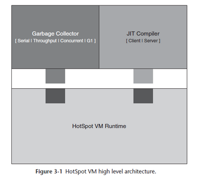

# JVM
## 一、简介
JVM 是Java 虚拟机的简称，是一个可以执行Java字节码的虚拟机进程。Java源文件被编译成能被Java虚拟机执行的字节码文件。

## 二、架构
分为 3 大部分：

| **特征** | GC | JIT Compiler | VM Runtime |
| :--- | :--- | :--- | :--- |
| 描述 | 垃圾回收器，用于内存管理 | **即时编译(Just in time)**，把解释型语言的可执行文件程序集转换到原生可执行代码 | Java 运行时 |
| 是否可配置 | 可配置 | 可配置，可选择不同 JIT | 无法配置 |

## 三、创建对象时，JVM 的操作步骤
在创建一个对象时，JVM会经历一系列的操作：
1. 类加载检查
2. 分配内存
3. 对象初始化
4. 设置对象信息