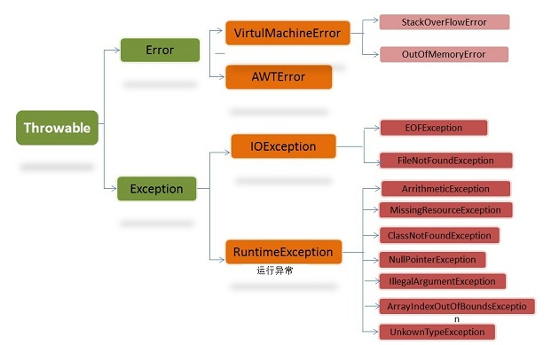

# Java
## 一、简介
Java 是一门面向对象编程(OOP)的语言，封装、继承、多态是 OOP 三大特性。子类继承父类的方法是，控制符必须`>=`父类的访问控制符
```
类 A 继承类 B 并重写 B 类的protected方法func时， A 中func方法的访问修饰符可以是？    B
A. private/protected
B. protected/public
C. private/public
D. private/protected/public
```

## 二、抽象 VS. 封装
抽象不是 OOP 的三要素。抽象和封装是互补的概念。一方面，抽象关注对象的行为。另一方面，封装关注对象行为的细节。
一般是通过隐藏对象内部状态信息做到封装，因此，**封装可以看成是用来提供抽象的一种策略**。

## 三、类型
Java 提供 8 种基础类型：
* 5种数字类型：short, int, long, float, double
* 布尔类型：boolean
* 字符类型：char
* 字节类型：byte

3 种引用类型：
* 数组
* 类
* 接口

| 描述 | 基本类型 | 对象/引用类型
| ---- | ------- | -----------
| 行为 | 只是一个值，没有任何行为 | 有自己的行为
| 内存分配 | **栈**内分配 | **对象**在**堆**内分配，**对象引用**保存在**栈**内
| 引用与值 | 仅表示一个值，保存在栈内 | 访问变量时，是通过引用找对象

## 四、访问修饰符
Java 中存在 4 种访问修饰符：权限依次递减
* public：最大权限，不受包、类的限制
* protected：次于 public, 同包下的类可访问，不同包下的，只有继承它的子类才可以访问
* default：同包才能访问
* private：只有本类成员才可以访问, private 修饰的方法不能被重写

## 五、异常


Exception 分为 2 种：
* 运行时异常：**JVM**的通常操作中可能遇到的异常，是一种常见运行错误
* 普通异常：**程序**运行过程中可能出现的非正常状态

Java编译器**要求**方法**必须**声明**抛出**可能发生的**非运行时异常**，但是并不要求必须声明抛出未被捕获的运行时异常

## 六、StringBuffer VS. StringBuilder
| **特征** | **StringBuffer** | **StringBuilder**
| -------- | ---------------- | -----------------
| **所在包** | java.lang.StringBuffer | java.lang.StringBuilder
| **线程安全性** | 线程安全 | 非线程安全
| **效率** | 较低 | 高
| **场景** | 多线程下操作大量数据 | 单线程下操作大量数据

## 七、== VS. equals
* == 操作符：比较的是对象的引用是否相等
* equals()：比较的是对象的值是否相等

```
public static void main(String[] args) {
    String s1 = "abc" + "def";
    String s2 = new String("abcdef");

    if (s1 == s2) {
        System.out.println("===succeed===");
    }

    if (s1.equals(s2)) {
        System.out.println("===equals() succeed===");
    }
}

### 输出结果
===equals() succeed===
```

## 八、集合迭代 for VS. foreach
| **特征** | for | for-each
| --- | --- | ---
| **描述** | 普通for循环 | 增强for循环，可以对所有实现 iterator 接口的对象进行迭代
| **版本支持** | 所有版本 | jdk1.5+ |
| **依赖** | 需要知道遍历数组/集合的大小 | 迭代对象需要实现 **iterator** 接口
| **原理** | 利用**下标定位**元素 | 利用 iterator 接口实现对象遍历 |
| **优缺点** | 循环时，无法对集合进行增加、删除操作 | 循环时，无法对集合进行增加、删除操作
| **场景** | 可预知大小的集合或数组 | 任何实现 iterator 接口的对象

## 九、ArrayList VS. LinkedList VS. Vector
| **特性** | **ArrayList** | **LinkedList** | **Vector** |
| :--- | :--- | :--- | :--- |
| 底层数据结构 | 数组 | 双向链表 | 数组 |
| 查询/索引速度 | 快 | 较慢 | 快(由于线程安全，性能比ArrayList低) |
| 插入速度 | 慢 | 快 | 慢 |
| 空间消耗 | 超过初始大小时，扩容50% |  | 超过初始大小时，扩容1倍 |
| 线程安全 | 不安全 | 不安全 | 安全 |
| 性能 | 最快 | 次快 | 慢 |

LinkedList 底层数据结构双向链表的验证
```
public static void main(String[] args) {
    LinkedList<Integer> li = new LinkedList<Integer>();
    li.add(1);
    li.add(2);
    System.out.println(li);                # [1, 2]

    # 链首插入数据
    li.add(0, 3);
    li.add(10);
    System.out.println(li);                # [3, 1, 2, 10]
}
```

## 十、ArrayBlockingQueue VS.. LinkedBlockingQueue
| **特征** | **ArrayBlockingQueue** | **LinkedBlockingQueue** |
| :--- | :--- | :--- |
| **锁的实现** | 不分离锁，生产和消费使用同一个锁 | 分离锁，生产使用 **putLock**，消费使用 **takeLock** |
| **操作** | 生产和消费时，**直接**将枚举对象插入或**移除** | 生产和消费时，**需**把枚举对象**转换**为 Node<E>进行插入或移除，会影响性能 |
| **队列初始化大小** | 必须指定队列的大小 | 可不指定队列的大小，默认是Integer.MAX_VALUE |