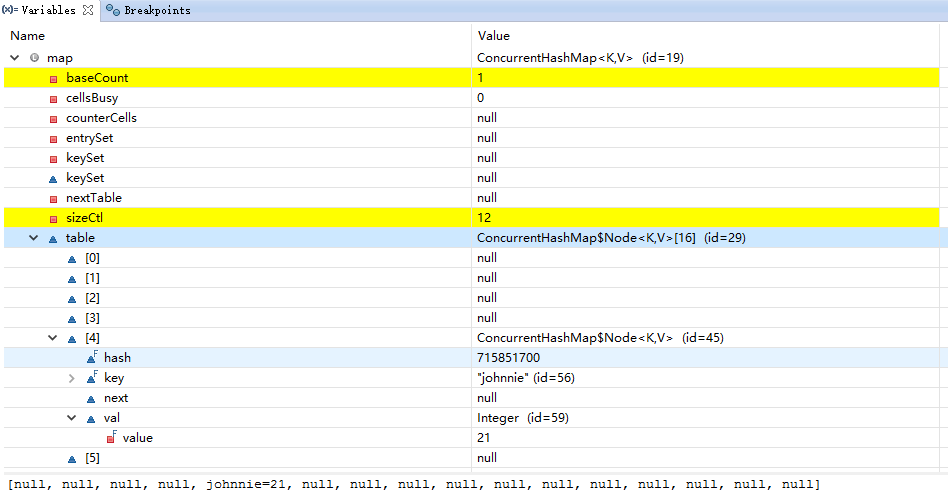
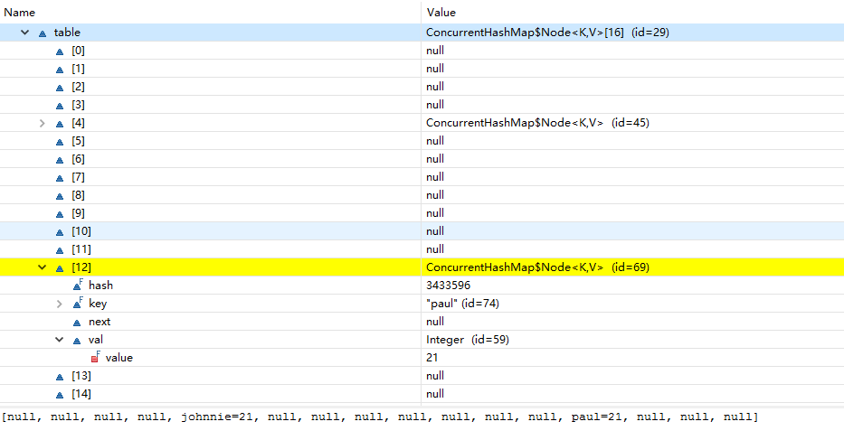

# ConcurrentHashMap
## 简介
说到 Map，首先想到的就是 HashMap 和 HashTable，但是 HashMap 是线程不安全的，而 HashTable 虽然是线程安全，但效率低下。在线程安全方面，
java 还有一个包`java.util.concurrent`，该包下**包含许多线程安全、高性能的并发类**。创建该包的目的就是要**实现集合框架在并发方面的线程安全**。

| **名称** | **类型** | **描述** |
| --- | --- | --- |
| Callabel<T> | 泛型接口 | 同 FutureTask 一起用于创建线程，主要方法 call() |
| FutureTask | 类 | 用于创建线程，定义线程执行的任务 |
| Future | 接口 | 表示异步计算的结果 |
| Semaphore | 类 | 控制某个资源可被同时访问的个数 |
| ReentrantLock | 类 | 具有与使用synchronized方法和语句所访问的隐式监视器锁相同的一些基本行为和语义，但功能更强大。在 ConcurrentHashMap中充当锁 |
| CountDownLatch | 类 |  |

## 原理
ConcurrentHashMap 就是该包下的一个线程安全 Map 实现，解决了 HashMap 线程不安全，而 HashTable 低性能的问题。该类拥有 HashTable 所有方法的实现。
HashTable 使用 synchronized 来保证线程安全，但使用 synchronized 带来的坏处就是会对整个 Hash 表进行锁定，每次锁定整张 Hash 表让某线程独占，造成
极大的浪费，从而导致效率低下。

| **特征** | **ConcurrentHashMap** | **HashTable** |
| :--- | :--- | :--- |
| 线程安全 | 安全 | 安全 |
| 效率 | 高 | 低 |
| 原理 | **锁分离**技术：默认将整个 Hash 表分为 16 个 segment(桶/段)，get,put,remove等常用操作**只锁当前需要用到的桶，因此可以并发操作** | synchronized |
| 默认容量 | 16 | 16 |
| Hash 表锁定 | 锁桶(段)，不锁整个 Hash 表 | 锁定整张 Hash 表 |

ConcurrentHashMap主要由 2 种数据结构组成：

1.**Segment**
* 一种**可重入锁**，用于保证线程安全
* 与 HashMap 类似，是一种数组和链表结构
* 一个 Segment 包含若干个Bucket
* 每个 Bucket 是由 Node 连接而成的链表
* 每个 Segment 其实就是一个小的 HashTable

```
static class Segment<K,V> extends ReentrantLock implements Serializable {
    private static final long serialVersionUID = 2249069246763182397L;
    final float loadFactor;
    Segment(float lf) { this.loadFactor = lf; }
}
```

2.**Node**
* 用于存储键值对数据
* 每个 Node 是一个链表结点
* 是 ConcurrentHashMap 中的一个内部类

> 网上说的 HashEntry 就是 Node

```
# ConcurrentHashMap.class
transient volatile Node<K,V>[] table;                // 数据存储

# ConcurrentHashMap$Node.class
static class Node<K,V> implements Map.Entry<K,V> {
    final int hash;
    final K key;
    volatile V val;
    volatile Node<K,V> next;

    Node(int hash, K key, V val, Node<K,V> next) {
        this.hash = hash;
        this.key = key;
        this.val = val;
        this.next = next;
    }

    public final K getKey()       { return key; }
    public final V getValue()     { return val; }
    public final int hashCode()   { return key.hashCode() ^ val.hashCode(); }
    public final String toString(){ return key + "=" + val; }
    public final V setValue(V value) {...}

    public final boolean equals(Object o) {...}

    Node<K,V> find(int h, Object k) {...}
}
```

debug分析：
```
public static void main(String[] args) {
    Map<String, Integer> map = new ConcurrentHashMap<>();
    map.put("johnnie", 21);
    map.put("paul", 21);
    map.put("lisa", 22);
    map.put("jessica", 22);
    map.put("alis", 23);
    map.put("ben", 24);
    map.put("john", 25);
}
```

执行 map.put("johnnie", 21) 的情况：



执行 map.put("paul", 21)的情况：



> baseCount: 2