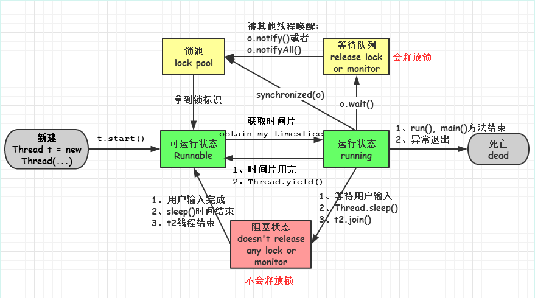

# 线程


## 二、线程 VS. 进程 VS. 协程
线程与进程的**本质区别**就是**线程共享地址空间**，其他的如效率区别等都是由于地址空间引起的

| **特征** | **线程** | **进程** | **协程** |
| --- | --- | --- | --- |
| 描述 | 用于并发编程，可以提高程序的并发度，提高程序运行效率和响应时间 | 用于并发编程，可以提高程序的并发度，提高程序运行效率和响应时间 | 一种**用户态**的**轻量级线程** |
| 数据共享 | **同进程**内线程共享数据，拥有**独立栈**，并**共享堆**数据 | **子进程共享父进程**内所有堆和栈数据 | 拥有独立栈，共享堆数据 |
| 地址空间 | **共享**地址空间(但有**独立栈空间**) | 各进程拥有**独立**地址空间 | 独立栈空间，共享堆空间 |
| 效率 | 创建速度快、线程间通讯快、切换快 | 比线程慢 | 极快，上下文切换是程序的切换，而不是线程切换，无线程切换开销 |
| 资源利用率 | 因共享地址空间，所以资源利用率高，但不利于资源管理与保护 | 比线程低 | 高 |
| 是否需要同步机制？ | 对公共变量/内存需要，因为共享地址空间，资源没隔离 | 不需要 | 不需要，在协程中**控制共享资源不加锁**，只需要判断状态 |
| 健壮性 | 比进程低 | 高，但比线程容易杀死 | 低 |

## 三、run() VS. start()
线程类 Thread 有 2 个常用方法 run(), start()。我们创建一个自定义线程都必须重写 run() ，然后调用 start() 来启动线程。那么二者之间到底有什么区别呢？

| **特征** | run() | start() |
| --- | --- | --- |
| 描述 | 用于定义线程需要执行的任务 | 用于启动/开启一个线程 |
| 来源 | 来自于Runable接口 | 来自于Thread类本身 |
| 启动线程的方法？ | 否 | 是 |

run()源码
```
@Override
public void run() {
    if (target != null) {
        target.run();                    // private Runnable target;
    }
}
```

start()源码
```
public synchronized void start() {
    if (threadStatus != 0)              // private volatile int threadStatus = 0;
        throw new IllegalThreadStateException();

    group.add(this);                    // private ThreadGroup group;

    boolean started = false;
    try {
        start0();                       // private native void start0();
        started = true;
    } finally {
        try {
            if (!started) {
                group.threadStartFailed(this);
            }
        } catch (Throwable ignore) {
            /* do nothing. If start0 threw a Throwable then
              it will be passed up the call stack */
        }
    }
}
```
start() 用来启动一个线程：**当调用start方法后，系统才会开启一个新的线程，进而调用run()方法来执行任务**。

**单独的调用run()就跟调用普通方法是一样的**，已经失去线程的特性。因此在启动一个线程的时候一定要使用 start() 而不是 run().
```
下面代码输出的结果是？
public static void main(String args[]) {
    Thread t = new Thread() {
        public void run() {
            print();
        }
    };
    t.run();
    System.out.print("MT");
}
static void print() {
    System.out.print("DP");
}

A. DPMT    B. MTDP    C. MTDP和DPMT都有可能    D. 都不输出

### 分析
调用的是 t.run() 而不是 t.start()，这样做并未开启一个线程，单独调用 run() 就如同调用普通方法一样，因此答案为 A
```

## 四、3 种线程创建方式
| **特征** | Thread | Runnable | Callable + Future |
| --- | --- | --- | --- |
| 所处包 | java.lang | java.lang | java.util.concurrent |
| 关键字 | extends | implements | implements |
| 方法 | run() | run() | call() |
| 泛型 | 否 | 否 | 是，Callable&lt;T&gt; |
| 线程创建 | new MyThread() | new Thread(new MyRun()); | new Thread(task, th_name) |
| 获取当前线程 | 直接使用 this 关键字即可 | Thread.currentThread() | Thread.currentThread() |
| 优缺点 | 编写简单，可直接通过 this 关键字获取当前线程;但存在单继承局限性; | 程序健壮，业务代码与线程数据分离；业务代码(Run方法内的代码)可以被多个线程共享 | 健壮，业务代码共享，子线程有返回值 |

> Java中，每次程序运行**至少启动2个线程**：一个是 main 线程，一个是 gc 线程

### 4.1 继承 Thread 类
```
class MyThread extend Thread {

    @override
    public void run() {
       // ...
    }
}


Thread th = new MyThread();
th.start()
```
Thread 类本身就实现了 Runnable 接口

### 4.2 实现 Runnable 接口：建议使用
```
class MyRunnable implements Runnable {

    @override
    public void run() {
       // ...
    }

}

Thread th = new Thread(new MyRunnable());
th.start()
```

### 4.3 通过 Callable 和 Future 创建线程
```
public class MyCall implements Callable<Integer> {

    @Override
    public Integer call() throws Exception {
        // 子线程任务
        int i = 0;
        for (; i < 10; i ++) {
            System.out.println(Thread.currentThread().getName() + "--> i = " + i);
        }
        return i;
    }

}

public class Main {

    public static void main(String[] args) {
        // 任务
        FutureTask<Integer> task = new FutureTask<>(new MyCall());

        for(int i = 0;i < 10; i++) {
            // 主线程
            System.out.println(Thread.currentThread().getName() + "--> i = " + i);

            // 当 i = 5 时创建子线程
            if(i == 5) {
                Thread th = new Thread(task, "CallThread");
                th.start();
            }
        }
        try {
            // get 方法获取子线程返回值
            System.out.println("CallThread return：" + task.get());
        } catch (Exception e) {
            e.printStackTrace();
        }

    }
}

### 输出
main--> i = 0
main--> i = 1
main--> i = 2
main--> i = 3
main--> i = 4
main--> i = 5
main--> i = 6
main--> i = 7
main--> i = 8
main--> i = 9
CallThread--> i = 0
CallThread--> i = 1
CallThread--> i = 2
CallThread--> i = 3
CallThread--> i = 4
CallThread--> i = 5
CallThread--> i = 6
CallThread--> i = 7
CallThread--> i = 8
CallThread--> i = 9
CallThread return：10
```

## 五、sleep() 和 wait() 区别
| **特征** | **sleep()** | **wait()** |
| --- | --- | --- |
| 所属类 | Thread 类 | Object 类 |
| 方法类别 | 类方法,  由 static 修饰 | 对象方法 |
| 功能 | 当前线程休眠，让权给其他线程，但**不释放锁** | 当前线程**释放对象锁**，进入线程池，只有针对本对象的 **notify()** 能唤醒它 |

二者的源码实现
```
# sleep
public static native void sleep(long millis) throws InterruptedException;

# wait
public final void wait() throws InterruptedException {
    wait(0);
}
```