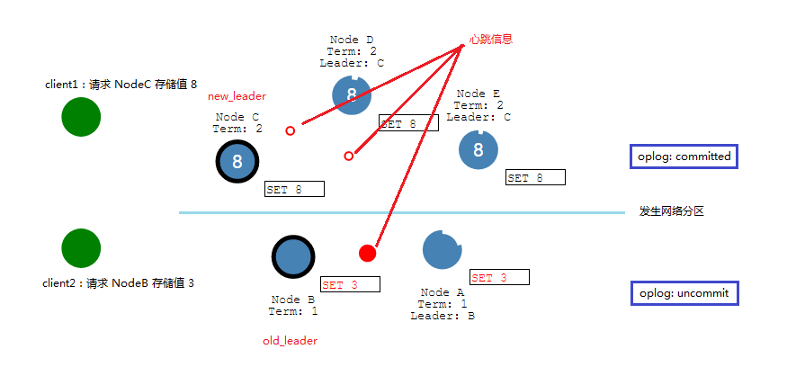

# Raft 算法
consul 在数据一致性方面采用 **Raft**算法，以此来提供整个 consul 集群的高可用。
> ectd 和 consul 采用 Raft 算法提供高可用(一致性)

## 一、简介
Raft 算法是一种用于实现分布式系统一致性的协议. [动画演示](http://thesecretlivesofdata.com/raft/)

## 二、角色/状态
Raft 是来自斯坦福研究的一种分布式协议，它与 Paxos 算法一样，都是用于提供数据一致
性的支持的。在 Raft 算法模型中，任何一个服务器 Server 都可以扮演一下 **3 种角色**：
1. **Leader**：领导节点，处理所有与客户端的交互、日志复制等。一个集群只有一个 Leader
2. **Follower**：从节点，类似于投票的选民，它的行为跟随 Leader。所有节点一开始都是 Follower 状态
3. **Candidate**：候选节点，类似于候选人，一旦 Leader 出现问题，候选人可以被选举成新的 Leader

## 三、阶段
Raft 分为一下 **2 个阶段**：选举 + 操作
### 3.1 选举阶段
任何一个节点都可以是 Candidate 节点，它向其他节点发出投票请求(Vote Request)，希望它们投票给自己。一旦其所获投票数超过半数(2N + 1)，该节点就荣升为 Leader 节点，
负责对外的所有事务。枚举的一般步骤如下：

1. 晋升 Candidate：一开始所有节点都是 Follower 节点，然后(**非同时**)开始在election timeout 时间内向 Candiadate 节点努力晋升。
2. 发起投票：一旦某 Follower 节点先于其他节点晋升为 Candidate 节点后，该节点开启一个新的选举阶段，开始发送 Vote Request 请求给其他 Follower 节点。
3. 投票：当其他**Follower 节点收到 Vote Request 后**，首先**重置自己晋升 Candidate 节点的进度**，然后投票给 Candiadate 节点。
4. 晋升 Leader：Candidate 节点收到大部分 Follower 的投票后，晋升为 Leader 节点
5. 心跳：Leader 节点开始发送心跳信息给 Follower 节点，**Follower 节点收到心跳信息后又重置自己晋升为 Candiadate 节点的进度**，并返回心跳信号给 Leader，告诉
它是存活的。

**[Q]**从枚举 Leader  的过程中知道，有 2 个阶段 Follower 会重置晋升进度，那么**什么时候 Follower 不重置晋升 Candiadate 的进度**？  
**[A]**很简单，当 Follower 节点无法同 Leader 通信后，它无法收到 Leader 发出的 heartbeat 信息，此时就不会重置晋升为 Candiadate 节点的进度，它会继续自己的晋升
进度，直到在 election timeout 时间内成功晋升为 Candiadate 节点，然后发起投票，最后成为新的 Leader。或者 Follower 节点在接受到 heartbeat 之前就完成了晋升为
Candiadate 阶段，成为 Candiadate 节点后，即使受到 heartbeat 也不需要重置了。

#### 3.1.1 选举设置
选举阶段存在 2 个配置：
1. election timeout：**选举超时**设置，用于设置 Follower 节点在多久时间内成为 Candiadate 节点，该值是一个随机值，取值范围是 150 ~ 300ms。
2. heartbeat timeout：**心跳超时**设置，用于设置 Leader 节点在多久时间内发生心跳信息给 Follower 节点。

#### 3.1.2 分裂投票
分裂投票（Splite Vote），若存在 2 个同时进行选举，且二者得票各占一半，此时二者将在 election timeout 后再次重新向其他节点进行邀票，重新选举，最终首先获得超半数票
数的节点成为 Leader。

### 3.2 正常操作阶段
当 Leader 已经被选举出来，作为与外界交互的外交官后，整个系统就开始在 Leader 的带领下进行正常操作。以 key-value 存储为例进行说明。
1. 客户端：发出请求，要求存储一个 key-value 键值对：{"age": 23}
2. Leader：接受请求，并在下一次 heartbeat 时要求所有 Follower 存储将该键值对存储到其 key-value 系统中，然后等待大部分 Follower 节点写入完毕
3. Follower：接受到 Leader 的指令，开始进行新 key-value 的存储。
4. Leader：收到大多数 Follower 存储成功的消息，然后返回响应给客户端，告诉客户端存储完毕。接着 Leader 将在**下一个心跳**中通知所有的 Follower 更新数据，保持一致

## 四、日志复制
**oplog** 是很重要的一种保持一致性的机制，Raft 算法要求分布式系统的每次操作都作为一条操作记录加入节点的 log 中，因此一旦系统中已经选举出了一个 Leader 节点，就会
有日志复制的操作，将系统的所有操作作为一条条记录存储下来，并备份到所有节点，保持日志数据的一致性。其流程和上述描述的 key-value 存储差不多。流程大致如下：
1. 客户端向 Leader 请求某个操作\(如存储数据\)，该操作记录将被记录到 leader  的 log 中，并标记该操作为 uncommit 状态
2. 在下一次 heartbeat 时，这个操作会被发送给其他的 follower
3. 当 leader 知道大部分 follwer 都将该 oplog 记录完毕后，将返回该操作的响应给 client，并标记该操作为 commit 状态

> 每一次 oplog 成功添加，表示该数据一定是一致的

## 五、Raft 在网络故障下的数据一致
若在存储数据的时候，发生网络故障(如网络分区)，使得当前的 Leader(假定为 old_leader) 不能与大多数 Follower 通信，则old_leader只能管理此时能通信的 Follower，而那
些由于网络故障导致无法通信的 Follower 因为发现没有 Leader 来进行领导，因此会重新枚举出一个新的 Leader(new_leader), 然后 new_leader 将代表这部分 Follower 与外
部通信。

由于 old_leader不是与大多数 follwer 通信的 leaer，因此它的 oplog 是 uncommit，而 new_leader 是与大多数 follwer 通信的，因此在网络分区故障时，它所有的操作
oplog 都是 commit 状态的。因此当网络恢复后， new_leader 会发送心跳给 NodeB 和 NodeA，让他们向自己同步，NodeB 和 NodeA 的数据会回滚之前 uncommited 的操作，并
将保持和 new_leader 一致，且 NodeB 从 old_leader 状态降级，变成普通的 follower，从而保证数据的一致性。

**[Q]** 若分区时客户端请求的操作不是同一个呢？即 client1 请求存储 {"age": 20}, client2 请求存储 {"name": "bascker"}，那么分区后的数据怎么办？  
**[A]** 对于非同一操作，client2 请求 old_leader 存储数据的 oplog 依旧是 uncommitted，在网络恢复后回滚该操作，使其生效。若是同一操作，如 client1 设置 age = 20
, 而 client2 设置 age = 30，那么以 oplog 的**时间戳**为准，那个是最新的操作，就同步哪个数据.
