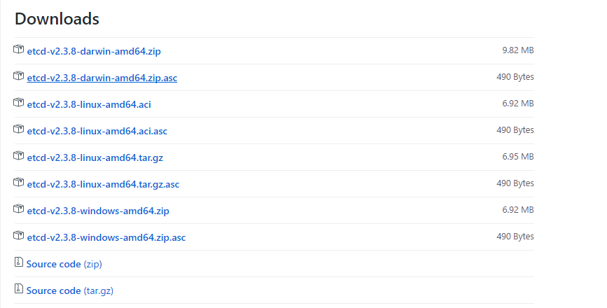

# Etcdctl 命令
## 一、简介
etcdctl 是 etcd 的客户端管理工具，是一个二进制的可执行文件，从 [git-etcd](https://github.com/coreos/etcd/releases/) 上可以下载。


```
# 解压后目录
$ ll etcd-v3.1.3-linux-amd64
total 29016
drwxrwxr-x 11 1000 1000     4096 Mar 11 01:14 Documentation
-rwxrwxr-x  1 1000 1000 15760192 Mar 11 01:14 etcd
-rwxrwxr-x  1 1000 1000 13897216 Mar 11 01:14 etcdctl
-rw-rw-r--  1 1000 1000    32633 Mar 11 01:14 README-etcdctl.md
-rw-rw-r--  1 1000 1000     5895 Mar 11 01:14 README.md
-rw-rw-r--  1 1000 1000     7935 Mar 11 01:14 READMEv2-etcdctl.md
```

## 操作
查看集群成员
```
$ etcdctl member list
115fb48a43e5831a: name=master0 peerURLs=http://master0:2380 clientURLs=http://localhost:2379,http://localhost:4001 isLeader=false
1a66a0777eab0664: name=master1 peerURLs=http://master1:2380 clientURLs=http://localhost:2379,http://localhost:4001 isLeader=false
d235237350b18cb9: name=master2 peerURLs=http://master2:2380 clientURLs=http://localhost:2379,http://localhost:4001 isLeader=true
```