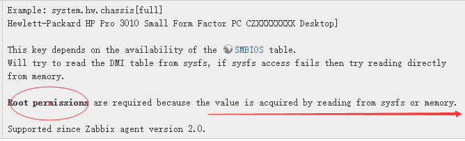
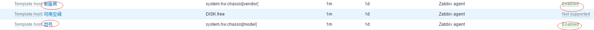

# FAQ
## 1.启动 agent 后日志报错
**场景**：启动 zabbix agent 后报错 failed to accept an incoming connection: connection from "10.158.113.43" rejected, allowed hosts: "vip-telemetry"

**原因**：配置错误。当前环境中 zabbix server 所在主机 ip 为 10.158.113.43，其 vip 为 vip-telemetry(10.158.113.47)。在配置 zabbix_agentd.conf 时，指定的 server = vip-telemetry。
```
$ cat zabbix_agentd.conf
...
Server=vip-telemetry
```
当 zabbix server 自动检测到本网段有 agent 启动后，发送数据包给 agent 请求连接，但该数据包的源地址是 10.158.113.43 不是 vip-telemetry 对应的 10.158.113.47，二者不匹配，因此拒绝连接。

**解决**：
* 法1：修改配置文件，将 Server 改为 10.158.113.43
* 法2：
  * 修改 /etc/hosts，建立 10.158.113.43 的 DNS
    ```
    $ vim /etc/hosts
    10.158.113.43 zabbix-server
    ```
  * 修改配置文件
    ```
    $ vim zabbix_agentd.conf
    Server=zabbix-server,vip-telemetry
    ```
> 注：zabbix 目前不支持 server 配置为 10.158.113.0/24 这种情况

## 2.如何将 zabbix web 界面的端口由 80 变为 8080？
**场景**：根据需求，需要将 zabbix web 的端口由 80 变为 8080

**解决**：主要分 2 步
1. 修改`/etc/httpd/conf/httpd.conf`的监听端口改为 8080
   ```
   $ vim /etc/httpd/conf/httpd.conf
   Listen 8080
   ```
2. 修改 `/etc/httpd/conf.d/zabbix.conf`
   ```
   $ vim zabbix.conf
   # 必须放在文件首部，否则出错
   NameVirtualHost *:8080
   <VirtualHost *:8080>
       ServerAdmin root@localhost
       Alias /zabbix /usr/share/zabbix
   </VirtualHost>
   ```

## 3.zabbix获取物理机“制造商”、"型号"失败
**场景**：容器环境下 zabbix 获取物理机“制造型”、“型号”信息失败，界面提示 Cannot get hardware information

**原因**：分别在宿主机和容器内执行 zabbix_agentd 命令获取数据，宿主机上显示成功，而容器内执行失败
```
# 宿主机
$ zabbix_agentd -t system.hw.chassis[full]
system.hw.chassis[full]                       [s|Red Hat KVM Other]

$ zabbix_agentd -t system.hw.chassis[model]                                # 型号
system.hw.chassis[model]                      [s|KVM]

$ zabbix_agentd -t system.hw.chassis[vendor]                               # 制造商
system.hw.chassis[vendor]                     [s|Red Hat]
```
通过分析，知容器内执行失败，是因为要获取“制造商”、“型号”的信息，**需要root权限，且需要访问 /dev/mem 目录**，而 zabbix-agent 的 pod 内没有赋予 root 权限，且没有挂载宿主机 /dev/mem 目录，因此失败。



**解决**：k8s 的 zabbix-agent.yaml 修改
```
- name: main
  securityContext:
    privileged: true                              # root 权限
  ...
  volumeMounts:
  - mountPath: /dev/mem
      name: host-mem
  ...
volumes:
  - name: host-mem
    hostPath:
      path: /dev/mem
```
修改后重建 pod 即可，且 zabbix web 界面会有显示：



### 4.zabbix_get命令执行失败
**场景**：使用 zabbix_get 命令获取 key 信息，报错
```
$ zabbix_get -s node4 -k system.hw.chassis[full]
zabbix_get [2646]: Check access restrictions in Zabbix agent configuration
```
**原因**：执行该命令的机器不是 zabbix-server 进程所在机器，而 **zabbix_get 命令需要 server 进程的支持**，它是在 server 上，通过查询 server 汇集的所有 agent 收集的数据，然后返回对应 key 的结果的。

**解决**：在 zabbix-server 所在节点上执行
```
$ zabbix_get -s node4 -p 10050 -k system.hw.chassis[model]
KVM
```