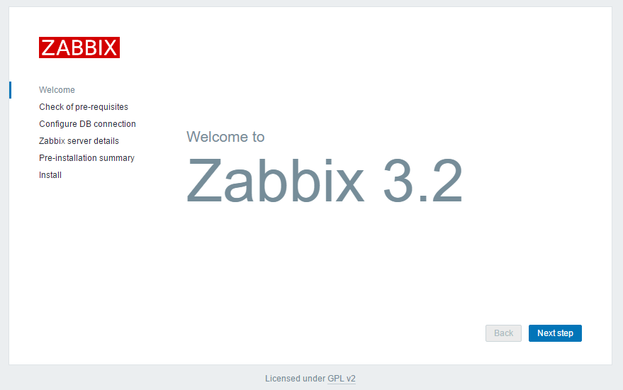
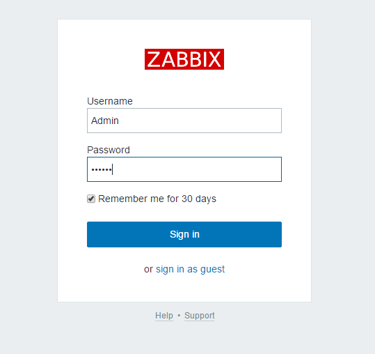
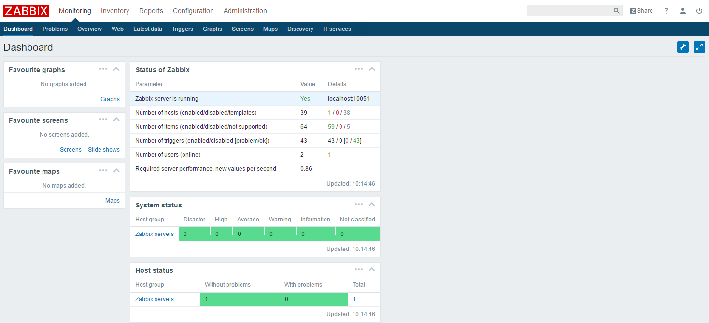
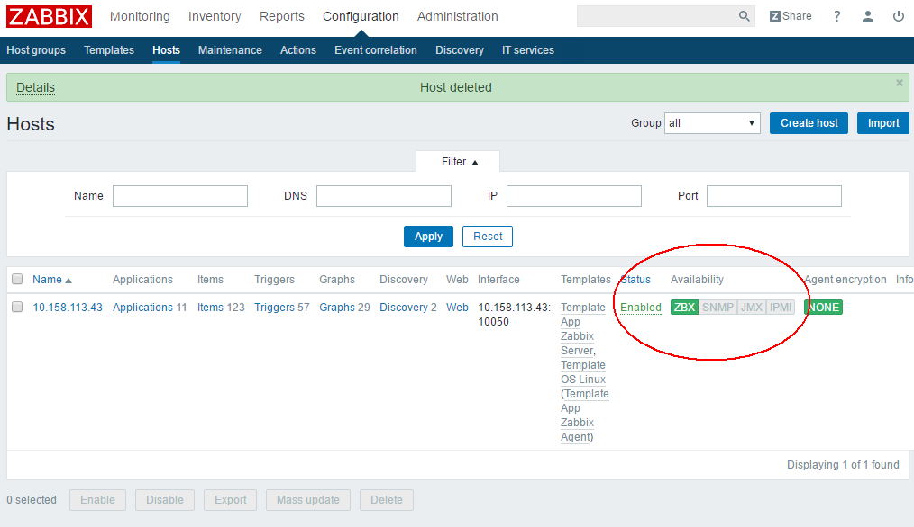

# 部署
## zabbix-server
1.启动一个容器
```
$ docker run -itd --name zabbix-server --net host --restart always centos:7 bash
```

2.yum源准备
```
$ rpm -ivh http://repo.zabbix.com/zabbix/3.2/rhel/7/x86_64/zabbix-release-3.2-1.el7.noarch.rpm
# 去掉 tsflags=nodocs, 否则不会生成 /usr/share/doc/zabbix-server-mysql-3.2.4 等帮助文档
$ yum install -y crudini
$ crudini --set /etc/yum.conf main tsflags ""
```

3.安装 zabbix-server
```
$ yum -y install zabbix-server-mysql zabbix-web-mysql
```

4.创建zabbix数据库并赋权
```
$ mysql
...
MariaDB [(none)]> create database zabbix character set utf8 collate utf8_bin;
Query OK, 1 row affected (0.01 sec)
MariaDB [(none)]>
MariaDB [(none)]> show databases;
+--------------------+
| Database           |
+--------------------+
| information_schema |
| mysql              |
| performance_schema |
| test               |
| zabbix             |
+--------------------+
5 rows in set (0.00 sec)
MariaDB [(none)]>
MariaDB [(none)]> grant all privileges on zabbix.* to 'zabbix'@'%' identified by '123456';
Query OK, 0 rows affected (0.00 sec)

# 测试
$ mysql -h mariadb -u zabbix -p123456
...
MariaDB [(none)]> show databases;
+--------------------+
| Database           |
+--------------------+
| information_schema |
| test               |
| zabbix             |
+--------------------+
3 rows in set (0.00 sec)

MariaDB [(none)]>
```

5.导入 zabbix 数据库
```
$ zcat /usr/share/doc/zabbix-server-mysql-3.2.*/create.sql.gz | mysql -h mariadb -u zabbix -p123456 --database=zabbix

# 执行完毕后
MariaDB [zabbix]> show tables;
+----------------------------+
| Tables_in_zabbix           |
+----------------------------+
| acknowledges               |
| actions                    |
| alerts                     |
...
| valuemaps                  |
+----------------------------+
127 rows in set (0.00 sec)
```

6.修改 `/etc/zabbix/zabbix_server.conf` 配置
```
$ vi /etc/zabbix/zabbix_server.conf
Timeout=30                             # 超时时间

DBHost = mariadb
DBPassword = 123456
DBName = zabbix
DBUser = zabbix
```

7.修改`/etc/httpd/conf.d/zabbix.conf`配置：修改时区
```
$ vi /etc/httpd/conf.d/zabbix.conf
php_value date.timezone Asia/Hong_Kong
```

8.启动 zabbix-server
```
# 修改 zabbix 用户可登录
$ vi /etc/passwd
zabbix:x:997:996:Zabbix Monitoring System:/var/lib/zabbix:/bin/bash

# 启动
$ su - zabbix -c "/usr/sbin/zabbix_server -c /etc/zabbix/zabbix_server.conf"
su: warning: cannot change directory to /var/lib/zabbix: No such file or directory

$ ps aux
USER       ... COMMAND
zabbix     ... /usr/sbin/zabbix_server -c /etc/zabbix/zabbix_server.conf
...
zabbix     ... /usr/sbin/zabbix_server: task manager [processed 0 task(s) in 0.001043 sec, idle 5 sec]
```

9.启动 http
```
$ /usr/sbin/httpd -DFOREGROUND
```

10.Zabbix Web配置：地址栏输入 [http://zabbix-server-ip/zabbix](http://zabbix-server-ip/zabbix) 显示如下



配置完毕后输入默认用户名密码 UserName：Admin, UserPass： zabbix  进入 Web界面





配置完 web 后会在 `/etc/zabbix/web/` 下生成 `zabbix.conf.php` 文件：
```
$ cat zabbix.conf.php
<?php
// Zabbix GUI configuration file.
global $DB;

$DB['TYPE']     = 'MYSQL';
$DB['SERVER']   = '10.158.113.150';
$DB['PORT']     = '0';
$DB['DATABASE'] = 'zabbix';
$DB['USER']     = 'zabbix';
$DB['PASSWORD'] = '123456';

// Schema name. Used for IBM DB2 and PostgreSQL.
$DB['SCHEMA'] = '';

$ZBX_SERVER      = 'localhost';
$ZBX_SERVER_PORT = '10051';
$ZBX_SERVER_NAME = '';

$IMAGE_FORMAT_DEFAULT = IMAGE_FORMAT_PNG;
```

## zabbix-agent
1.启动容器
```
$ docker run -itd --name zabbix-agent --net host --restart always centos:7 bash
```

2.安装软件
```
$ yum install -y zabbix-agent
```

3.修改配置：`/etc/zabbix/zabbix_agentd.conf`
```
$ vi zabbix_agentd.conf
Server = 10.158.113.150                   # 允许来自 10.158.113.150 的 zabbix-server 检测该 agent
ServerActive = 10.158.113.150             # zabbix 主动监控 server 的 ip 地址
Hostname  = 10.158.113.150                # 每个 agent 所在节点的主机名或IP，不是 server 的
AllowRoot = 1
Timeout=30
```

4.启动 zabbix-agent
```
$ zabbix_agentd -c /etc/zabbix/zabbix_agentd.conf

$ ps aux
USER       PID %CPU %MEM    VSZ   RSS TTY      STAT START   TIME COMMAND
root        79  0.0  0.0  80644  1240 ?        S    02:09   0:00 zabbix_agentd -c /etc/zabbix/zabbix_agentd.conf
root        80  0.0  0.0  80644  1584 ?        S    02:09   0:00 zabbix_agentd: collector [idle 1 sec]
root        81  0.0  0.0  80760  2300 ?        S    02:09   0:00 zabbix_agentd: listener #1 [waiting for connection]
root        82  0.0  0.0  80760  2188 ?        S    02:09   0:00 zabbix_agentd: listener #2 [waiting for connection]
root        83  0.0  0.0  80760  2252 ?        S    02:09   0:00 zabbix_agentd: listener #3 [waiting for connection]
root        84  0.0  0.0  80644  2028 ?        S    02:09   0:00 zabbix_agentd: active checks #1 [idle 1 sec]
root        96  0.0  0.0  47424  1660 ?        R+   02:11   0:00 ps aux

$ tail -f /var/log/zabbix/zabbix-agent.log
79:20180308:020909.819 Starting Zabbix Agent [Zabbix server]. Zabbix 3.2.4 (revision 65975).
79:20180308:020909.819 **** Enabled features ****
79:20180308:020909.819 IPv6 support:          YES
79:20180308:020909.819 TLS support:           YES
79:20180308:020909.819 **************************
79:20180308:020909.819 using configuration file: /etc/zabbix/zabbix_agentd.conf
79:20180308:020909.819 agent #0 started [main process]
80:20180308:020909.820 agent #1 started [collector]
81:20180308:020909.820 agent #2 started [listener #1]
82:20180308:020909.820 agent #3 started [listener #2]
83:20180308:020909.821 agent #4 started [listener #3]
84:20180308:020909.821 agent #5 started [active checks #1]
```
> 对 server 和 agent 进程，若想前台运行，则使用 -f 选项

5.查看zabbix是否已经成功部署：进入web页面查看

