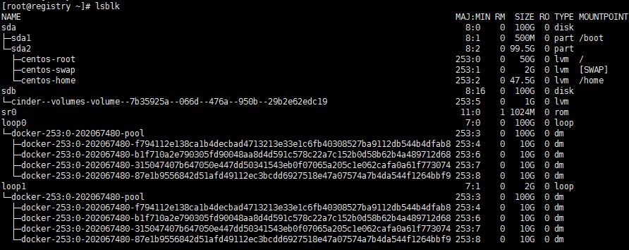

# lsblk
## 简介

用于列出所有可用**块设备**\(硬盘，闪存盘，CD-ROM\)的信息，但不会列出RAM盘的信息。

## 案例

参数解释：

* **NAME**: 块设备名
* **MAJ:MIN**：显示主要和次要设备号
* **RM**: 显示设备是否可移动设备。1 表示可移动，0 不可移动
* **SIZE**: 列出设备的容量大小信息
* **RO**: 表明设备是否为只读。1 表示只读，0 不是只读
* **TYPE**:显示块设备是否是磁盘或磁盘上的一个分区
* **MOUNTPOINT**: 指出设备挂载的挂载点