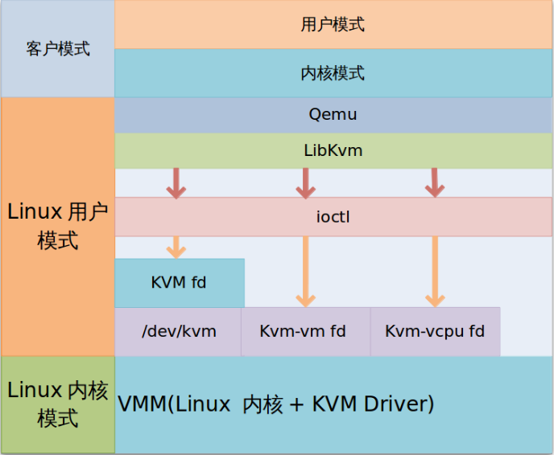

# KVM
## 简介
KVM\(Kenel-based virtual machine\)一种架构简单性能良好的开源虚拟化技术，2007年被集成到Linux中，是企业级的虚拟化产品。

组成：

* _**kvm.ko**_\(kvm-intel.ko或kvm-amd.ko\)：一个为处理器提供底层虚拟化、可加载的核心模块
* _**qemu-kvm**_：虚拟机上层控制工具

基本架构图：

> 图片来自：[http://www.linuxidc.com/Linux/2015-01/112328.htm](http://www.linuxidc.com/Linux/2015-01/112328.htm)

## 使用
要使用 kvm 虚拟化，必须确定服务器的CPU虚拟化是否支持：进入 _BIOS _设置 _**Virtualization Technology**_ 为 Enable

KVM虚拟化常用管理工具：

* Virt-Manager：图形化的虚拟机管理工具
* _**virt-install**_：用于命令行方式创建 KVM 虚拟机的工具，其常用参数如下：
  * --name：设置虚拟机名称
  * --ram：设置VM CPU，单位 MB
  * --vcpus：设置CPU个数
  * --hvm：设置使用全虚拟化
  * --os-type：设置OS类型
  * --cdrom：指定使用 cdrom 安装系统，指定 ISO 位置
  * --file：设置VM硬盘文件路径
  * --file-size：设置硬盘大小，单位GB
  * --bridge：设置VM连接的网桥
  * --vnc：打开VNC支持
  * --vncport：配置VN端口