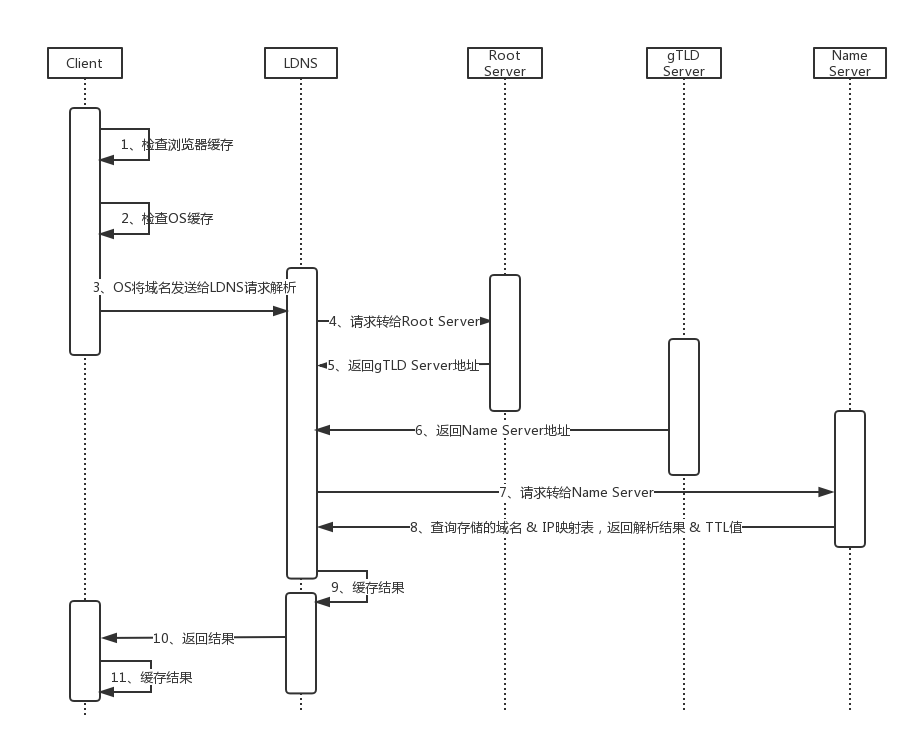

# DNS
## 简介
DNS 即域名解析

## 域名解析过程
DNS 域名解析主要过程：

Note：
1. 检查浏览器缓存，若存在则直接返回
2. 检查OS缓存，若存在则直接返回
3. LDNS,本地区域名服务器，若在学校，LDNS就在学校。若是小区，就是电信、联通等
LDNS 承担了主要的DNS解析工作，大概80%的请求，都再此完成.
4. gTLD 是国际顶级域名服务器
5. Name Server是请求的域名注册时的服务器

