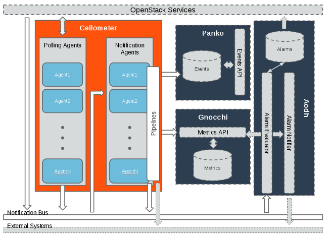

# 架构
## 计量服务整体架构

上图是计量服务的整体架构，整个计量服务由 `ceilometer + aodh + backend store`组成

ceilometer提供的 2 个核心服务：
* **polling agent**：compute 和 central，用于去获取监控信息并建立 meter 项
* **notification agent**： 该守护进程被设计用于去监听消息队列的信息，将消息转为Event和Sample，并执行指定的 pipeline 动作

**aodh**：用于提供告警服务。
**Gnocchi**：用于存储计量数据，如图所示作为 ceilometer **对 meter 的后端存储**，可以实现高效存储与查询。Gnocchi 的目标是取代已经存在的数据库接口。
**Panko**：是一个 event 存储项目，如图所示作为 ceilometer 的 **event 后端存储**。是一个面向文档型的数据库，一般用于存储诸如日志、系统 event 动作数据。

## 参考文献
1. 官网-架构：[https://docs.openstack.org/developer/ceilometer/architecture.html\#multi-publisher](https://docs.openstack.org/developer/ceilometer/architecture.html#multi-publisher)
2. 官网-gnocchi：[https://docs.openstack.org/developer/gnocchi/](https://docs.openstack.org/developer/gnocchi/)
3. 官网-panko：[https://docs.openstack.org/developer/panko/](https://docs.openstack.org/developer/panko/)