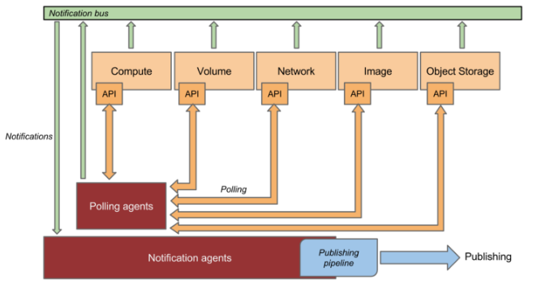
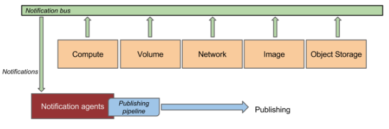
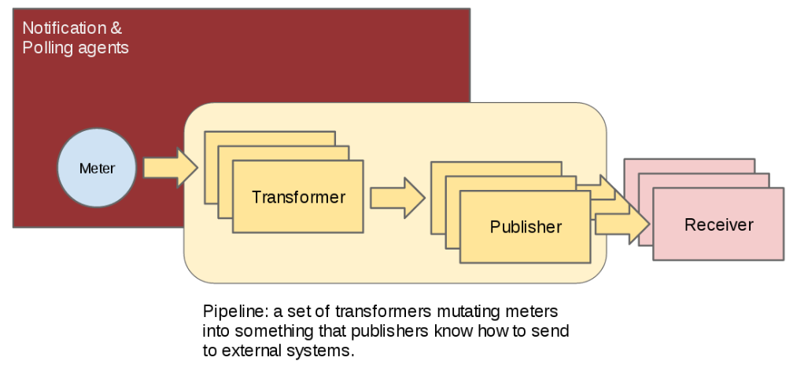

# 数据处理
## 简介
ceilometer 对数据的获取主要通过 polling agent 和 notification agent，前者获取 OpenStack 相关信息或云下信息然后建立 meter 项，后者主要监控消息队列获取 AMQP  信息，转为 event 和 sample 数据，执行相应的 pipeline 动作。

## 数据收集
### 介绍



上图展示了 ceilometer 是如何从多个 source 渠道获取监控数据的。**ceilometer** 的数据收集方式有 **2 **种：

1.**通知**：**notification**，直接从 Notification Bus 上收集

* **ceilometer-notifcation**：penstack 内部组件/服务发生的事情都会发出对应的 notification 消息，如虚机的创建和删除。ceilometer-notification 可以消费这些消息，转为 event 或 sample 信息。

2.**轮询**：polling，云上资源通过 openstack 组件的 api 来获取, 云下物理机通过 snmp、ipmi等获取

* **ceilometer-compute**：主要负责云上信息
* **ceilometer-central**：主要负责集成外部插件，如 SNMP、IPMI等获取云下信息

> **notification **方式是数据收集的**首选\(preferred\)方式。polling 方式不是首选方式的原因是加载它可能会对 API 服务造成影响**

### 数据监听：notification-agent

ceilometer-notification 会监听消息队列并消费这些消息。notification agent 会加载一个或多个 **listener** 插件来监听 topic 信息，默认会去监听 3 种信息：

* notification.info
* notification.sample
* notification.error



notification agent 会通过使用 `ceilometer-notification` 命名空间来设置1个或多个 listener 插件

```
[ceilometer.notification]
sample = ceilometer.telemetry.notifications:TelemetryIpc
floatingip = ceilometer.network.notifications:FloatingIP
hardware.ipmi.current = ceilometer.ipmi.notifications.ironic:CurrentSensorNotification
...
http.request = ceilometer.middleware:HTTPRequest
http.response = ceilometer.middleware:HTTPResponse
instance = ceilometer.compute.notifications.instance:Instance
instancescheduled = ceilometer.compute.notifications.instance:InstanceScheduled
meter = ceilometer.meter.notifications:ProcessMeterNotifications
network = ceilometer.network.notifications:Network
network.services.firewall = ceilometer.network.notifications:Firewall
...
port = ceilometer.network.notifications:Port
router = ceilometer.network.notifications:Router
subnet = ceilometer.network.notifications:Subnet
```

### 数据请求：polling-agent
polling agent 会通过 API 去查询服务的数据。一般计算资源\(compute resouces\)的数据是通过运行在计算节点上的 ceilometer-compute-agent 处理的，非计算资源的数据是通过运行在控制节点上的 ceilometer-central-agent 获取的。

polling agent 都会通过 `ceilometer.poll.compute, ceilometer.poll.central, ceilometer.poll.ipmi` 命名空间来设置一个或多个 pollster 插件。

```
[ceilometer.poll.central]
energy = ceilometer.energy.kwapi:EnergyPollster
image = ceilometer.image.glance:ImagePollster
image.size = ceilometer.image.glance:ImageSizePollster
ip.floating = ceilometer.network.floatingip:FloatingIPPollster
network.services.firewall = ceilometer.network.services.fwaas:FirewallPollster
...

[ceilometer.poll.compute]
cpu = ceilometer.compute.pollsters.cpu:CPUPollster
cpul3cache = ceilometer.compute.pollsters.cpu:CPUL3CachePollster
cpuutil = ceilometer.compute.pollsters.cpu:CPUUtilPollster
disk.allocation = ceilometer.compute.pollsters.disk:AllocationPollster
...

[ceilometer.poll.ipmi]
hardware.ipmi.current = ceilometer.ipmi.pollsters.sensor:CurrentSensorPollster
hardware.ipmi.fan = ceilometer.ipmi.pollsters.sensor:FanSensorPollster
hardware.ipmi.node.airflow = ceilometer.ipmi.pollsters.node:AirflowPollster
hardware.ipmi.node.cpuutil = ceilometer.ipmi.pollsters.node:CPUUtilPollster
hardware.ipmi.node.cups = ceilometer.ipmi.pollsters.node:CUPSIndexPollster
...
```

数据  polling 的频率由 pipeline.yaml 文件来控制。关于**高效 polling**可以通过 ceilometer.conf 来设置，主要有以下 2 点：
```
$ vim ceilometer.conf
[DEFAULT]
# 为了减少 polling agent 的负担，默认会批量的将 sample 发给 notification agent
# 为提高生产效率，生产环境下建议设置为 False
batchpolledsamples = False

# 设置开始 polling 之前的 shuffler 时间，避免短时间内发出大量轮训请求，默认值为 0
shuffletimebeforepollingtask = 10
```

## 数据处理
由 **ceilometer-notification** 使用 **Pipeline** 的方式，即 **Metes** 数据依次经过 **Transformer** 和 **Publisher **处理，最后达到 **Receivers\(**包括 ceilometer-collector 和 外部系统 **\)**



从 **ceilometer-notification** 的日志中可以看到如下显示：
```
$ vim  ceilometer-agent-notification.log
INFO ceilometer.pipeline [-] detected decoupled pipeline config format
INFO ceilometer.publisher.messaging [-] Publishing policy set to default
INFO ceilometer.pipeline [-] Pipeline cpusink: Setup transformer instance rateofchange with parameter {'target': {'scale': '100.0 / (10**9 * (resourcemetadata.cpunumber or 1))', 'type': 'gauge', 'name': 'cpuutil', 'unit': '%'}}
...
WARNING ceilometer.transformer.conversions [-] dropping sample with no predecessor:(<name: network.incoming.bytes, volume: 648, resourceid: instance-0000006d-d2640d38-13e9-4630-813b-e5ae9eec127b-tap1c06bd81-8b, timestamp: ....>,)
```

**Transformer**是Sample 的转换器，负责数据的转换；**Publisher**是分发器，负责数据的发布。
> 二者具体信息看 pipeline.yaml 一节

配置案例：

```
$ vim pipeline.yaml
---
sources:
    - name: metersource
      interval: 600
      meters:
          - "*"
      sinks:
          - metersink
    ...
    - name: hardwaresource
      interval: 300
      meters:
          - "hardware.*"
      resources:
          - snmp://computer1
          - snmp://computer2
          - snmp://computer3
      sinks:
          - metersink
  sinks:
    - name: metersink
      transformers:
      publishers:
          - notifier://
    - name: cpusink
      transformers:
          - name: "rateofchange"
            parameters:
                target:
                    name: "cpuutil"
                    unit: "%"
                    type: "gauge"
                    scale: "100.0 / (10**9 * (resourcemetadata.cpunumber or 1))"
    ...
```

### 数据保存方式

**ceilometer-collector** 从 **AMQP**接收到数据后，会原封不动地通过一个或者多个分发器\(**dispatchers**\)将它保存到指定位置。通过 **ceilometer.conf** 文件配置。所支持的分发器有如下几种：

* **文件分发器**：保存到文件 。添加配置项dispatcher = file 和 \[dispatcher\file\] 部分的配置项
* **HTTP 分发器**：保存到外部的 HTTP target 。添加配置项 dispatcher = http
* **数据库分发器**：保存到数据库。 添加配置项 dispatcher = database。默认使用 MongoDB

**ceilometer** 的数据收集方式有 **2 **种：

1.**通知**方式：**notification**，直接从 Notification Bus 上收集
* ceilometer-notifcation
> 通知 notification：openstack 内部组件/服务发生的事情都会发出对应的 notification 消息，如：虚机的创建和删除。ceilometer-notification 就可以消费这些消息获取对应的计量信息

2.**轮询**方式：**poller，**云上资源通过 openstack 组件的 api 来获取, 云下物理机通过 snmp 协议获取
* ceilometer-compute
* ceilometer-central

## 数据处理
由 **ceilometer-notification** 使用 **Pipeline** 的方式，即 **Metes**数据依次经过 **Transformer** 和 **Publisher**处理，最后达到 **Receivers\(**包括 ceilometer-collector 和 外部系统 **\)**

从 **ceilometer-notification** 的日志中可以看到如下显示：
```
$ vim  ceilometer-agent-notification.log
INFO ceilometer.pipeline [-] detected decoupled pipeline config format
INFO ceilometer.publisher.messaging [-] Publishing policy set to default
INFO ceilometer.pipeline [-] Pipeline cpusink: Setup transformer instance rateofchange with parameter {'target': {'scale': '100.0 / (10**9 * (resourcemetadata.cpunumber or 1))', 'type': 'gauge', 'name': 'cpuutil', 'unit': '%'}}
...
WARNING ceilometer.transformer.conversions [-] dropping sample with no predecessor:(<name: network.incoming.bytes, volume: 648, resourceid: instance-0000006d-d2640d38-13e9-4630-813b-e5ae9eec127b-tap1c06bd81-8b, timestamp: ....>,)
```

**Transformer**：Sample 的转换器，负责数据的转换

* unit\_conversion：单位转换器，比如温度从°F 转换成°C
* rate\_of\_change：计算方式转换器
* accumulator：累计器

**Publisher**：分发器，负责数据的发布。采集的信息可以通过以下方式publish 出来，由 pipeline.yaml 控制

* **RPC**：将信息以payload方式发布到消息队列，collector监听对应的queue来收集信息，并保存到存储介质中
* **UDP**：通过socket创建一个UDP数据通道，然后collector通过bind这个socket来接收数据，并保存到存储介质中
* **File**：将采集的数据以filelog的方式写入log文件中

配置案例：

```
$ vim pipeline.yaml
---
sources:
    - name: metersource
      interval: 600
      meters:
          - "*"
      sinks:
          - metersink
    ...
    - name: hardwaresource
      interval: 300
      meters:
          - "hardware.*"
      resources:
          - snmp://computer1
          - snmp://computer2
          - snmp://computer3
      sinks:
          - metersink
  sinks:
    - name: metersink
      transformers:
      publishers:
          - notifier://
    - name: cpusink
      transformers:
          - name: "rateofchange"
            parameters:
                target:
                    name: "cpuutil"
                    unit: "%"
                    type: "gauge"
                    scale: "100.0 / (10**9 * (resourcemetadata.cpunumber or 1))"
    ...
```

## 数据保存
**ceilometer-collector** 从 **AMQP**接收到数据后，会原封不动地通过一个或者多个分发器\(dispatchers\)将它保存到指定位置。通过 **ceilometer.conf** 文件配置。所支持的分发器有如下几种：

* **文件分发器**：保存到文件 。添加配置项dispatcher = file 和 \[dispatcher\file\] 部分的配置项
* **HTTP 分发器**：保存到外部的 HTTP target 。添加配置项 dispatcher = http
* **数据库分发器**：保存到数据库。 添加配置项 dispatcher = database。默认使用 MongoDB

## 参考文献
1. 官网-概述：[https://docs.openstack.org/developer/ceilometer/glossary.html\#term-notification-agent](https://docs.openstack.org/developer/ceilometer/glossary.html#term-notification-agent)
2. 官网-配置：[https://docs.openstack.org/newton/config-reference/telemetry/samples/ceilometer.conf.html](https://docs.openstack.org/newton/config-reference/telemetry/samples/ceilometer.conf.html)