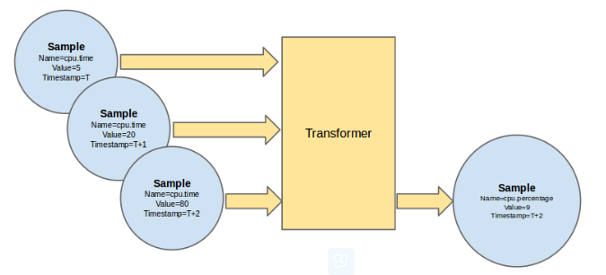
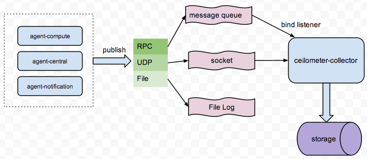
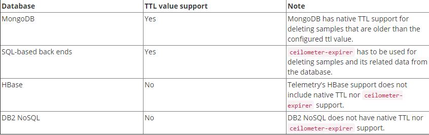

# pipeline
## 简介
pipeline 的默认配置文件是 pipeline.yaml，其配置也可以在 ceilometer.conf 中以 pipeline\cfg\file 参数来配置。一个职责链的定义的语法格式如下所示：
```
---
sources:
  - name: 'source name'
    meters:
      - 'meter name'
    sinks
      - 'sink name'
sinks:
  - name: 'sink name'
    transformers: 'definition of transformers'
    publishers:
      - 'list of publishers'
```

语法解释：
* sources
  * name：定义资源名称，没啥用，只是来区别各资源的
  * meters：定义具体需要采集的一个或多个的 meter 项，可以使用通配符采集所有资源，也可采用指定具体采集项
    ```
    meters:
      - '*'          # 采集所有资源
      - 'cpuutil'   # 采集 cpuutil 信息
      - '!image'     # 不采集 image 信息
      - 'disk.*'     # 采集所有 disk 信息
    ```
  * sinks：设置采样数据要经过的处理链\(走哪个 transformer，走哪个 publisher\)
    > sources.sinks 设置的值必须要 sinks 中有定义
* sinks
  * name：数据处理链的名称
  * transformers：定义要经过的数据转换器，0 个或多个
  * publishers：定义处理完的采样数据公示位置，1 个或多个

## transformer


通过 pipeline.yaml 中定义 meter 的 transformer 来对 meter 进行数据处理，如单位转换，计算等。ceilometer支持以下 **5 种** transformer：

1.**rate\_of\_change**
```
# 对cpu数据进行转换
transformers:
    - name: "rateofchange"
      parameters:
          target:
              name: "cpuutil"
              unit: "%"
              type: "gauge"
              scale: "100.0 / (10**9 * (resourcemetadata.cpunumber or 1))"
```
将 cpu 的数据转换后，将值传给 cpu\_util \(该计量项是自定义的，也可写成 cpu.util\)

> 注：无法将一个已经定义好的 meter 的数据处理后，再赋值给它。必须是取另一个名字，从而生成一个新的 meter 项来保存

```
# 对disk数据进行转换
transformers:
    - name: "rateofchange"
      parameters:
          source:
              mapfrom:
                  name: "disk\\.(read|write)\\.(bytes|requests)"
                  unit: "(B|request)"
          target:
              mapto:
                  name: "disk.\\1.\\2.rate"
                  unit: "\\1/s"
              type: "gauge"
```

该定义的意思是将如下 meter 项的值转为 disk.1.2.rate. 其上数字 1, 2 分别代表分组后索引位置的元素值：
* 1：表示匹配 \(read\|write\) 的值，取值 read 或 write
* 2：表示匹配 \(bytes\|requests\) 的值，取值 bytes 或 requests

```
# 源数据
disk.read.bytes
disk.read.requests
disk.write.bytes
disk.write.requests
disk.device.read.bytes
disk.device.read.requests
disk.device.write.bytes
disk.device.write.requests

# 目标数据
disk.read.bytes.rate
disk.read.requests.rate
disk.write.bytes.rate
disk.write.requests.rate
disk.device.read.bytes.rate
disk.device.read.requests.rate
disk.device.write.bytes.rate
disk.device.write.requests.rate
```

2.**unit\_conversion**

单位转换器，和 **rate\_of\_chang**一样，支持 scale、mapfrom和mapto

```
transformers:
    - name: "unitconversion"
      parameters:
          source:
              mapfrom:
                  name: "disk\\.(read|write)\\.bytes"
          target:
              mapto:
                  name: "disk.\\1.kilobytes"
              scale: "volume * 1.0 / 1024.0"
              unit: "KB"
```

3.**aggregator**

聚合器，每聚集 15 条数据后，按 `user_id`和`resource_metadata`处理一次

```
transformers:
    - name: "aggregator"
      parameters:
          size: 15
          userid: first
          resourcemetadata: drop
```

4.**arithmetic**

计算器，支持计算公式，使用 **expr**来定义计算公式，使用 **$** 获取计量值。

案例：设置将 memory.usage 的 MB 采样数据换算为 %，获取内存使用量的百分比

```
---
sources:
    ...
    - name: memorysource
      interval: 30
      meters:
          - "memory.usage"
      sinks:
          - memorysink
sinks:
    ...
    - name: memorysink
      transformers:
          - name: "arithmetic"
            parameters:
                target:
                    name: "memory.util"
                    unit: "%"
                    type: "gauge"
                    expr: "100 * $(memory.usage) / $(memory.usage).resourcemetadata.flavor.ram"
      publishers:
          - notifier://
```

> 注：expr 中只能获取 sources.meters 中设置要处理的计量值的采样数值

5.**delta**
```
transformers:
    - name: "delta"
      parameters:
        target:
            name: "cpu.delta"
        growthonly: True
```

## publisher


ceilometer 利用 publisher 设置采样后数据的公示位置。与其定义相关的配置文件除了 [pipline.yml](pipline.md) 还有 event_pipline.yml

ceilometer 支持以下几种 publisher：
* **gnocchi**：默认值
* **panko**
* **notifier**：会将采样数据通过 AMQP 发到 oslo.messaging 中
* **udp**
* **file**
* **http**
* direct：已弃用
* kafaka：已弃用
* database：已弃用，此功能已被 gnocchi 和 panko 取代
  

## 参考文献
1. 官网-配置文件：[https://docs.openstack.org/developer/ceilometer/configuration.html](https://docs.openstack.org/developer/ceilometer/configuration.html)
2. 官网-系统架构：[https://docs.openstack.org/developer/ceilometer/architecture.html\#multi-publisher](https://docs.openstack.org/developer/ceilometer/architecture.html#multi-publisher)
3. 官网-publisher：[https://docs.openstack.org/developer/ceilometer/install/custom.html\#publisher-configuration](https://docs.openstack.org/developer/ceilometer/install/custom.html#publisher-configuration)
4. 官网-transformers：[https://docs.openstack.org/admin-guide/telemetry-data-pipelines.html\#telemetry-transformers](https://docs.openstack.org/admin-guide/telemetry-data-pipelines.html#telemetry-transformers)

