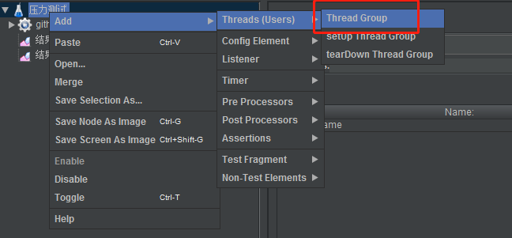

# jmeter
## 一、简介
Apache开源的一款压力测试的工具，可前往[官方下载地址](https://jmeter.apache.org/download_jmeter.cgi)下载，其使用方法很简单，下载完压缩包后，解压即可。进入bin目录下，点击`jmeter.bat`以管理员方式启动即可。  

## 二、并发测试
以测试github能否在1min内成功处理1000次请求为例，进行说明。

1.设计计划名：压力测试，并设置变量  

2.创建线程组，并设置并发参数  
  

3.在线程组下，创建Http Request  
  

4.创建结果视图：
* 结果数：用于查看每次请求结果
* 聚合报告：用于汇总成报表

5.运行查看结果  
  

参数解释：
* Average：平均响应时间，单个request的响应时间。
* Median：50%用户的响应时间。
* 90%Line：90%用户的响应时间。
* Min：最小响应时间
* Max：最大响应时间
* Error%：测试中出现错误的总数
* Throughput：吞吐量，每秒处理的请求数

从结果看到，大多数HTTP请求报429（太多请求）状态码，说明github对客户端请求数进行了限制。响应结果中，
Retry-After参数告诉我们，129ms后再请求。